# Transformer 架构

本文件展示了完整的 Transformer 架构结构图, 使用 Mermaid 绘制, 并按照模块化结构进行拆分.

---

## 📋 架构参数说明

| 参数             | 符号 | 说明               |
| ---------------- | ---- | ------------------ |
| Batch Size       | B    | 批次大小           |
| Sequence Length  | L    | 序列长度           |
| Hidden Dimension | H    | 隐藏层维度         |
| Number of Heads  | h    | 注意力头数         |
| Head Dimension   | d_k  | 每个头的维度 (H/h) |
| FFN Dimension    | 4H   | 前馈网络中间层维度 |
| Number of Layers | N    | 编码器/解码器层数  |

---

## 🔹 Self-Attention 模块(SelfAttentionBlock)

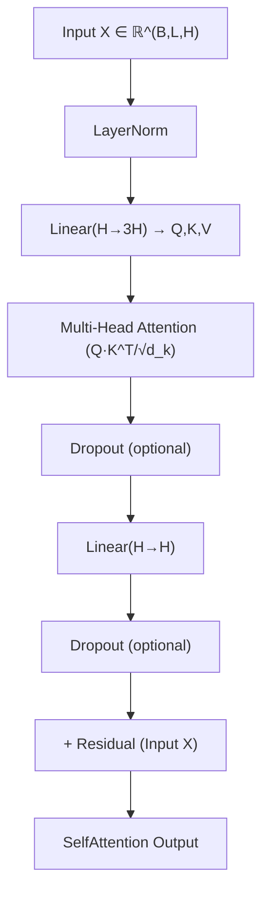
```mermaid
graph TD
    SA_Input["Input X ∈ ℝ^(B,L,H)"] --> SA_LN1[LayerNorm]
    SA_LN1 --> SA_QKV["Linear(H→3H) → Q,K,V"]
    SA_QKV --> SA_Attn["Multi-Head Attention (Q·K^T/√d_k)"]
    SA_Attn --> SA_Drop["Dropout (optional)"]
    SA_Drop --> SA_OutProj["Linear(H→H)"]
    SA_OutProj --> SA_Drop2["Dropout (optional)"]
    SA_Drop2 --> SA_Residual["+ Residual (Input X)"]
    SA_Residual --> SA_Out[SelfAttention Output]
```

---

## 🔹 Attention 变体对比 (MHA vs GQA vs MQA)

### 1. Multi-Head Attention (MHA)

标准 Transformer 使用。每个 Query Head 都有对应的 Key/Value Head。

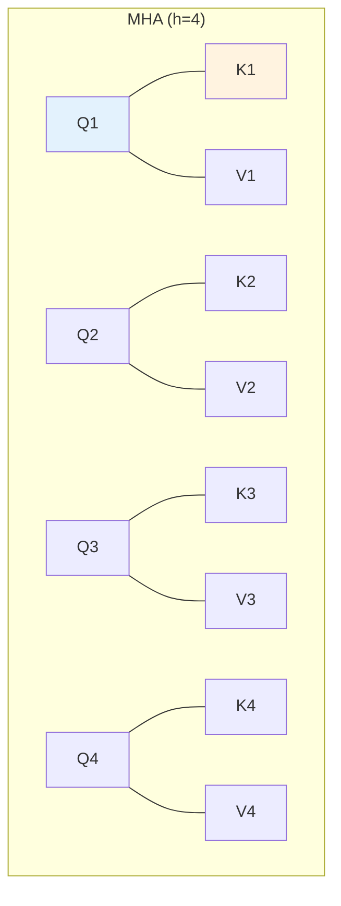
```mermaid
graph TD
    subgraph "MHA (h=4)"
        Q1[Q1] --- K1[K1] & V1[V1]
        Q2[Q2] --- K2[K2] & V2[V2]
        Q3[Q3] --- K3[K3] & V3[V3]
        Q4[Q4] --- K4[K4] & V4[V4]
    end
    style Q1 fill:#e3f2fd
    style K1 fill:#fff3e0
```

### 2. Grouped Query Attention (GQA)

LLaMA 2/3 使用。多个 Query Head 共享一组 Key/Value Head。
(例如: 4个 Query Head, 2组 KV Head -> 2 Q share 1 KV)

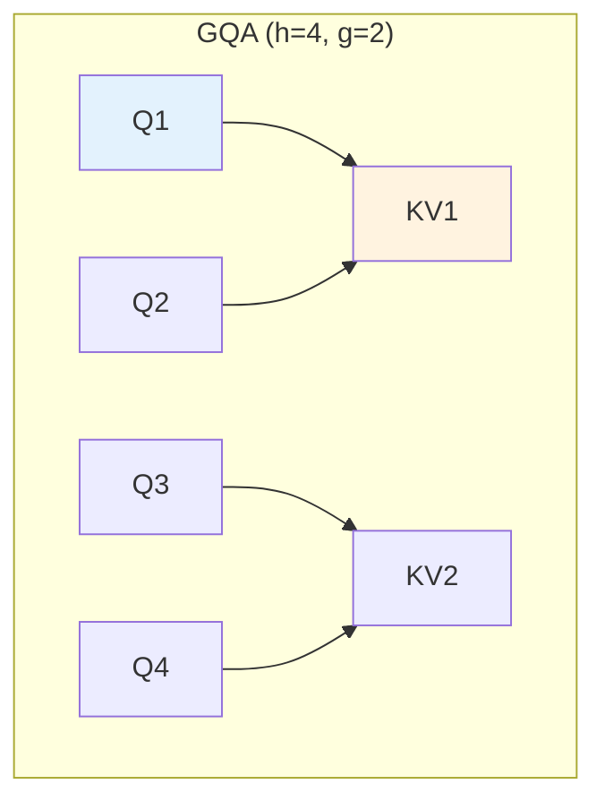
```mermaid
graph TD
    subgraph "GQA (h=4, g=2)"
        Q1[Q1] --> KV1[KV1]
        Q2[Q2] --> KV1
        Q3[Q3] --> KV2[KV2]
        Q4[Q4] --> KV2
    end
    style Q1 fill:#e3f2fd
    style KV1 fill:#fff3e0
```

### 3. Multi-Query Attention (MQA)

极致显存优化。所有 Query Head 共享同一组 Key/Value Head。

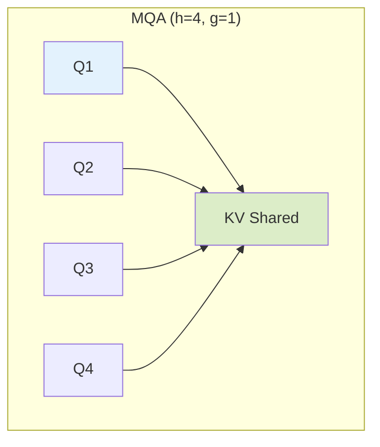
```mermaid
graph TD
    subgraph "MQA (h=4, g=1)"
        Q1[Q1] --> KV[KV Shared]
        Q2[Q2] --> KV
        Q3[Q3] --> KV
        Q4[Q4] --> KV
    end
    style Q1 fill:#e3f2fd
    style KV fill:#dcedc8
```

---

## 🔹 FeedForward 模块(FeedForwardBlock)

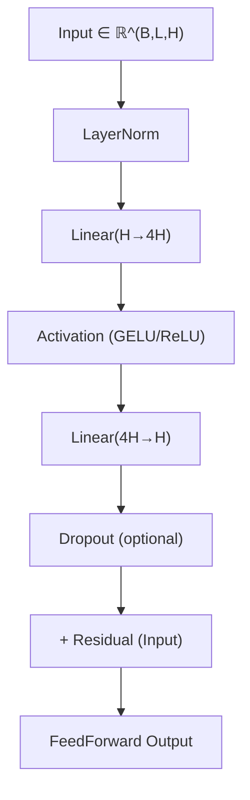
```mermaid
graph TD
    FF_Input["Input ∈ ℝ^(B,L,H)"] --> FF_LN[LayerNorm]
    FF_LN --> FF_Linear1["Linear(H→4H)"]
    FF_Linear1 --> FF_Act["Activation (GELU/ReLU)"]
    FF_Act --> FF_Linear2["Linear(4H→H)"]
    FF_Linear2 --> FF_Drop["Dropout (optional)"]
    FF_Drop --> FF_Residual["+ Residual (Input)"]
    FF_Residual --> FF_Out[FeedForward Output]
```

---

## 🔹 MoE 模块(MoEBlock)

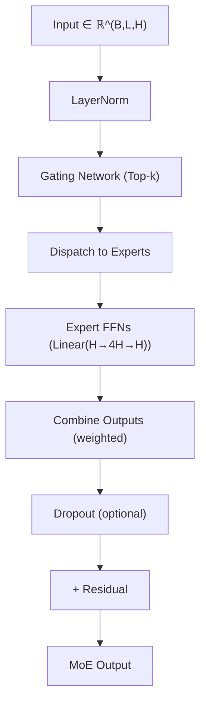
```mermaid
graph TD
    MoE_Input["Input ∈ ℝ^(B,L,H)"] --> MoE_LN[LayerNorm]
    MoE_LN --> MoE_Gate["Gating Network (Top-k)"]
    MoE_Gate --> MoE_Dispatch[Dispatch to Experts]
    MoE_Dispatch --> MoE_Expert["Expert FFNs (Linear(H→4H→H))"]
    MoE_Expert --> MoE_Combine["Combine Outputs (weighted)"]
    MoE_Combine --> MoE_Drop["Dropout (optional)"]
    MoE_Drop --> MoE_Residual[+ Residual]
    MoE_Residual --> MoE_Out[MoE Output]
```

---

## 🔹 Transformer Encoder Block

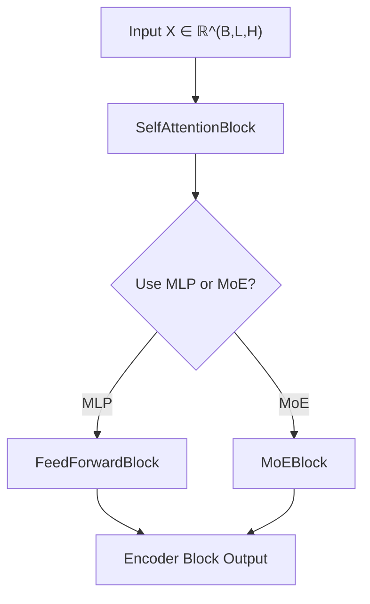
```mermaid
graph TD
    ENC_In["Input X ∈ ℝ^(B,L,H)"] --> SA[SelfAttentionBlock]
    SA --> FF_or_MoE{Use MLP or MoE?}
    FF_or_MoE -->|MLP| FF[FeedForwardBlock]
    FF_or_MoE -->|MoE| MoE[MoEBlock]
    FF --> ENC_Out[Encoder Block Output]
    MoE --> ENC_Out
```

---

## 🔹 Transformer Decoder Block(含 Cross-Attention + MoE)

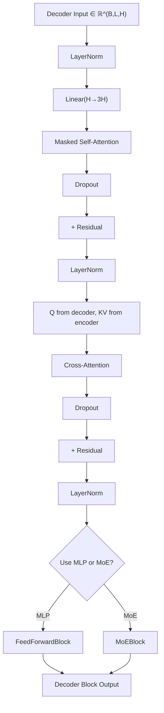
```mermaid
graph TD
    DEC_In["Decoder Input ∈ ℝ^(B,L,H)"] --> D_LN1[LayerNorm]
    D_LN1 --> D_QKV["Linear(H→3H)"]
    D_QKV --> D_MaskedAttn[Masked Self-Attention]
    D_MaskedAttn --> D_Drop1[Dropout]
    D_Drop1 --> D_Res1[+ Residual]
    D_Res1 --> D_LN2[LayerNorm]
    D_LN2 --> Cross_QKV["Q from decoder, KV from encoder"]
    Cross_QKV --> CrossAttn[Cross-Attention]
    CrossAttn --> D_Drop2[Dropout]
    D_Drop2 --> D_Res2[+ Residual]
    D_Res2 --> D_LN3[LayerNorm]
    D_LN3 --> FF_or_MoE2{Use MLP or MoE?}
    FF_or_MoE2 -->|MLP| FF2[FeedForwardBlock]
    FF_or_MoE2 -->|MoE| MoE2[MoEBlock]
    FF2 --> DEC_Out[Decoder Block Output]
    MoE2 --> DEC_Out
```

---

## 🔹 位置编码模块(PositionalEncoding)

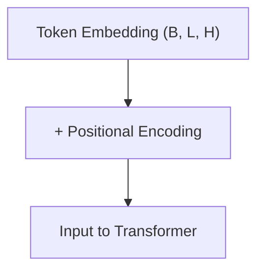
```mermaid
graph TD
    PE_Embed["Token Embedding (B, L, H)"] --> PE_Add[+ Positional Encoding]
    PE_Add --> PE_Out[Input to Transformer]
```

**说明: 位置编码可以是**

- **Sinusoidal**(静态)
- **Learned**(可训练)
- **RoPE**(旋转位置编码, 适用于 QK)
- **Alibi**(线性偏移 attention logits)

---

## 🔹 Transformer Encoder Stack

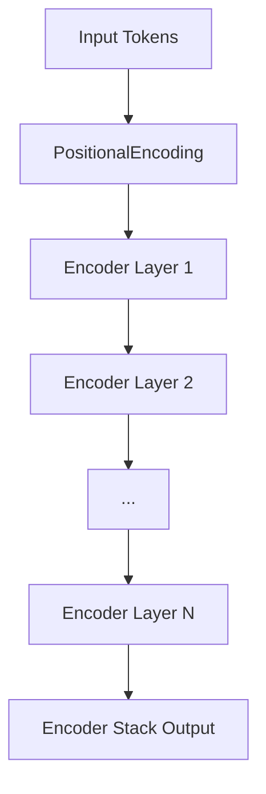
```mermaid
graph TD
    Input[Input Tokens] --> PosEnc[PositionalEncoding]
    PosEnc --> E1[Encoder Layer 1]
    E1 --> E2[Encoder Layer 2]
    E2 --> E3[...]
    E3 --> EN[Encoder Layer N]
    EN --> EncoderOutput[Encoder Stack Output]
```

---

## 🔹 Transformer Decoder Stack

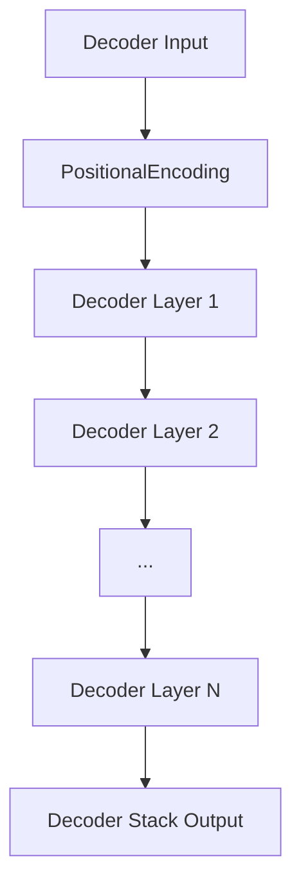
```mermaid
graph TD
    DecInput[Decoder Input] --> PosEncD[PositionalEncoding]
    PosEncD --> D1[Decoder Layer 1]
    D1 --> D2[Decoder Layer 2]
    D2 --> D3[...]
    D3 --> DN[Decoder Layer N]
    DN --> DecoderOutput[Decoder Stack Output]
```

**注意:** Decoder 每层都访问 Encoder Stack 的输出作为 Cross-Attention 的 KV.

---

## 🔹 完整 Transformer 模型架构

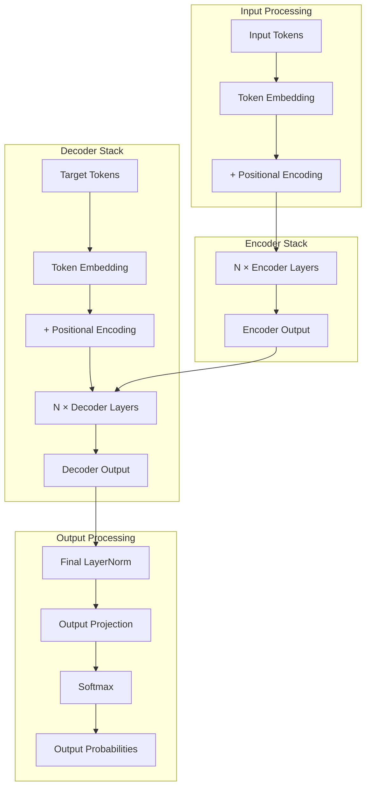
```mermaid
graph TD
    subgraph "Input Processing"
        InputTokens[Input Tokens] --> TokenEmbed[Token Embedding]
        TokenEmbed --> PosEnc1[+ Positional Encoding]
    end

subgraph "Encoder Stack"
PosEnc1 --> EncStack[N × Encoder Layers]
EncStack --> EncOut[Encoder Output]
end

subgraph "Decoder Stack"
TargetTokens[Target Tokens] --> TargetEmbed[Token Embedding]
TargetEmbed --> PosEnc2[+ Positional Encoding]
PosEnc2 --> DecStack[N × Decoder Layers]
EncOut --> DecStack
DecStack --> DecOut[Decoder Output]
end

subgraph "Output Processing"
DecOut --> FinalLN[Final LayerNorm]
FinalLN --> OutputProj[Output Projection]
OutputProj --> Softmax[Softmax]
Softmax --> Probs[Output Probabilities]
end
```
