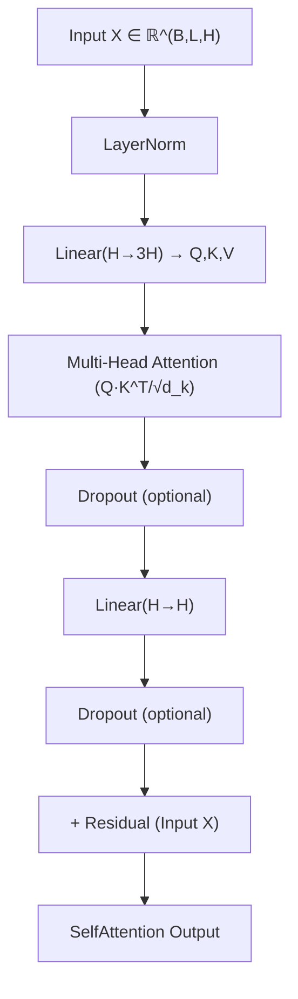
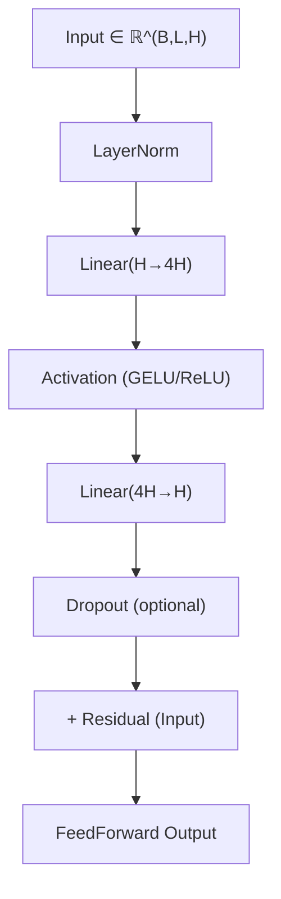
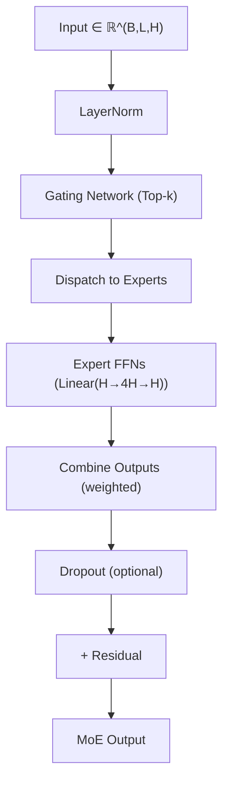
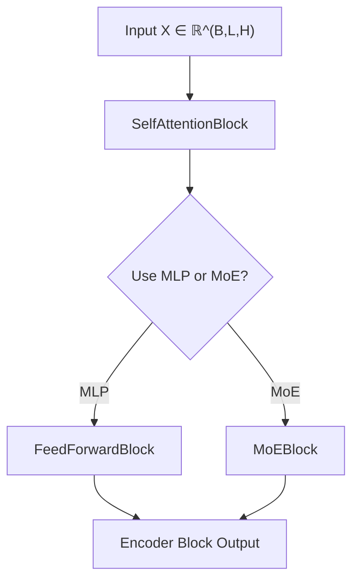
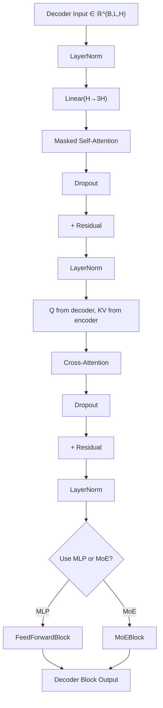
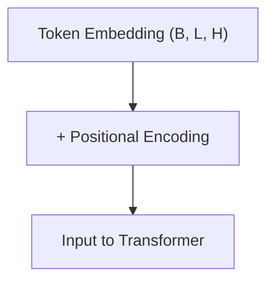
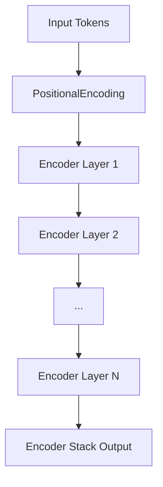
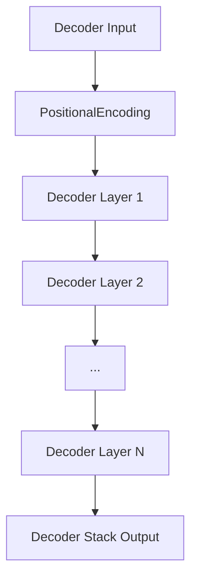
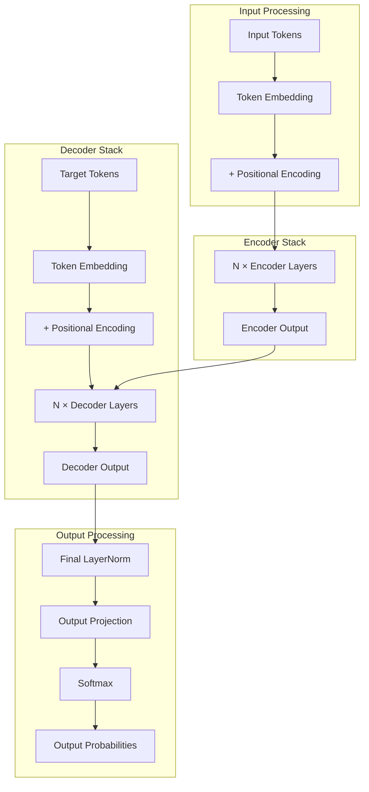

# Transformer 架构

本文件展示了完整的 Transformer 架构结构图，使用 Mermaid 绘制，并按照模块化结构进行拆分。

---

## 📋 架构参数说明

| 参数               | 符号  | 说明           |
|------------------|-----|--------------|
| Batch Size       | B   | 批次大小         |
| Sequence Length  | L   | 序列长度         |
| Hidden Dimension | H   | 隐藏层维度        |
| Number of Heads  | h   | 注意力头数        |
| Head Dimension   | d_k | 每个头的维度 (H/h) |
| FFN Dimension    | 4H  | 前馈网络中间层维度    |
| Number of Layers | N   | 编码器/解码器层数    |

---

## 🔹 Self-Attention 模块（SelfAttentionBlock）

---

## 🔹 FeedForward 模块（FeedForwardBlock）

---

## 🔹 MoE 模块（MoEBlock）

---

## 🔹 Transformer Encoder Block

---

## 🔹 Transformer Decoder Block（含 Cross-Attention + MoE）

---

## 🔹 位置编码模块（PositionalEncoding）

**说明：位置编码可以是**

- **Sinusoidal**（静态）
- **Learned**（可训练）
- **RoPE**（旋转位置编码，适用于 QK）
- **Alibi**（线性偏移 attention logits）

---

## 🔹 Transformer Encoder Stack

---

## 🔹 Transformer Decoder Stack

**注意：** Decoder 每层都访问 Encoder Stack 的输出作为 Cross-Attention 的 KV。

---

## 🔹 完整 Transformer 模型架构

