# Transformer 架构完全学习指南

> 从零开始理解 Transformer 模型的核心架构

---

## 📚 学习导航

1. [基础概念](#基础概念)
2. [核心组件](#核心组件)
3. [完整架构](#完整架构)
4. [实际应用](#实际应用)

---

## 🎯 基础概念

### 什么是 Transformer？
Transformer 是一种基于**注意力机制**的神经网络架构，主要用于处理序列数据（如文本、语音等）。它的核心思想是: **让模型能够关注到输入序列中最重要的部分**。

### 关键参数表
| 参数 | 符号 | 含义 | 举例 |
|------|------|------|-------|
| 批次大小 | B | 一次处理多少个句子 | 32 |
| 序列长度 | L | 每个句子有多少个词 | 512 |
| 隐藏维度 | H | 每个词用多少维向量表示 | 768 |
| 注意力头数 | h | 同时关注几个不同方面 | 12 |
| 每头维度 | d_k | 每个头的维度 (H÷h) | 64 |

---

## 🔧 核心组件

### 1️⃣ 自注意力机制 (Self-Attention)
**作用: ** 让每个词都能"看到"句子中的其他词，理解上下文关系

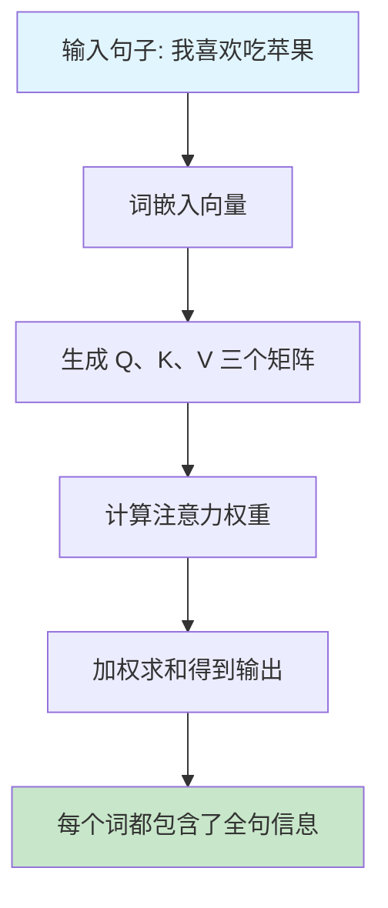

**🔍 深入理解自注意力**

**Step 1: 三个关键矩阵**
- **Q (Query): ** "我想找什么信息？" - 查询矩阵
- **K (Key): ** "我有什么信息？" - 键矩阵
- **V (Value): ** "具体的信息内容" - 值矩阵

**Step 2: 计算过程**
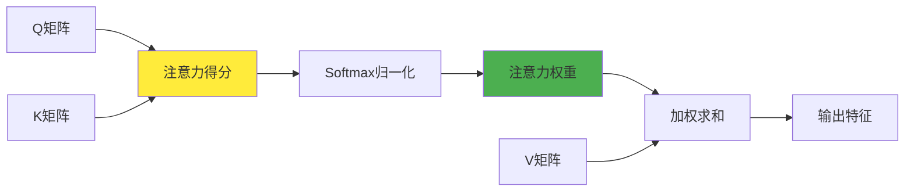

**实际例子: ** 在句子"我喜欢吃苹果"中
- 当处理"苹果"时，模型会计算它与所有词的关系
- 发现"苹果"与"吃"和"喜欢"关系密切
- 最终"苹果"的表示会融合这些相关信息

### 2️⃣ 前馈网络 (Feed Forward)
**作用: ** 对每个位置的信息进行深度处理和转换

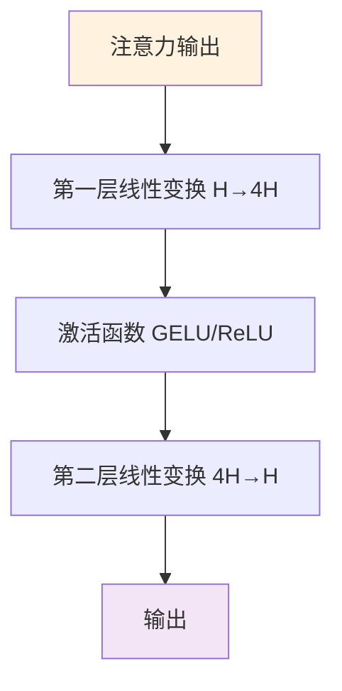

### 3️⃣ 层归一化 & 残差连接
**作用: ** 稳定训练过程，防止梯度消失

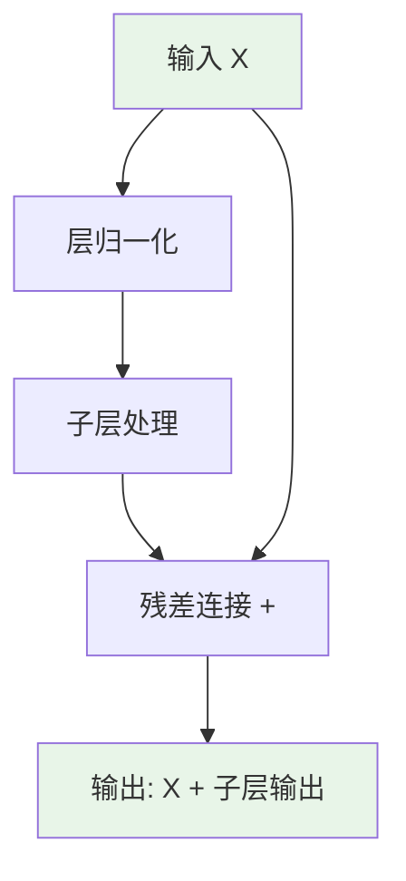

**🎯 为什么需要这两个技术？**

**残差连接的作用: **
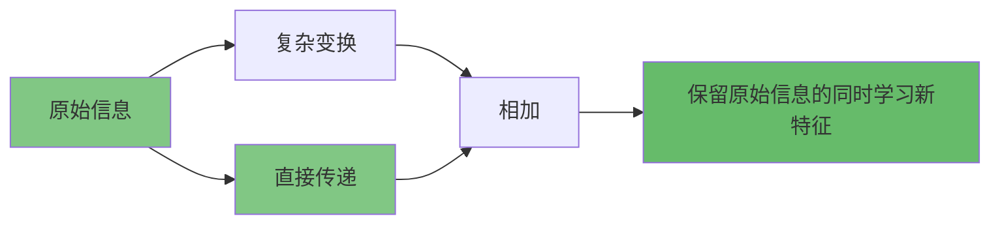

**层归一化的作用: **
- 让每层的输入分布保持稳定
- 加速训练收敛
- 减少对学习率的敏感性

**公式解释: **
LayerNorm(x) = γ × (x - μ) / σ + β
- μ: 均值，σ: 标准差
- γ, β: 可学习参数

---

## 🏗️ 完整架构

### Encoder-Decoder 结构总览

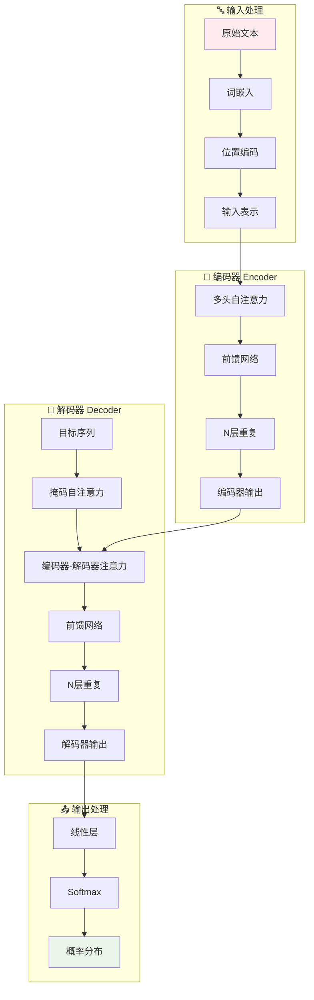

### 单个 Transformer 层详解

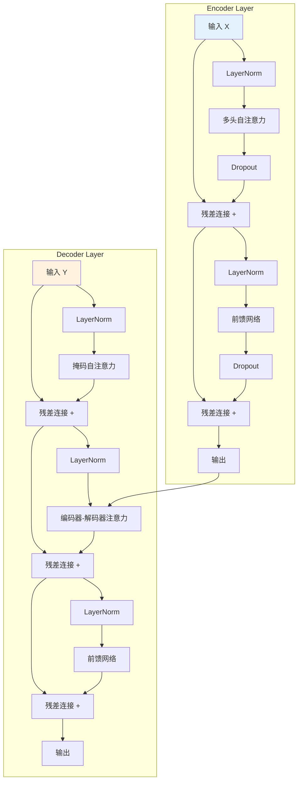

---

## 🔍 关键概念深入

### 多头注意力 (Multi-Head Attention)
**为什么需要多头？**
- 单头注意力只能关注一种关系
- 多头可以同时关注: 语法关系、语义关系、位置关系等

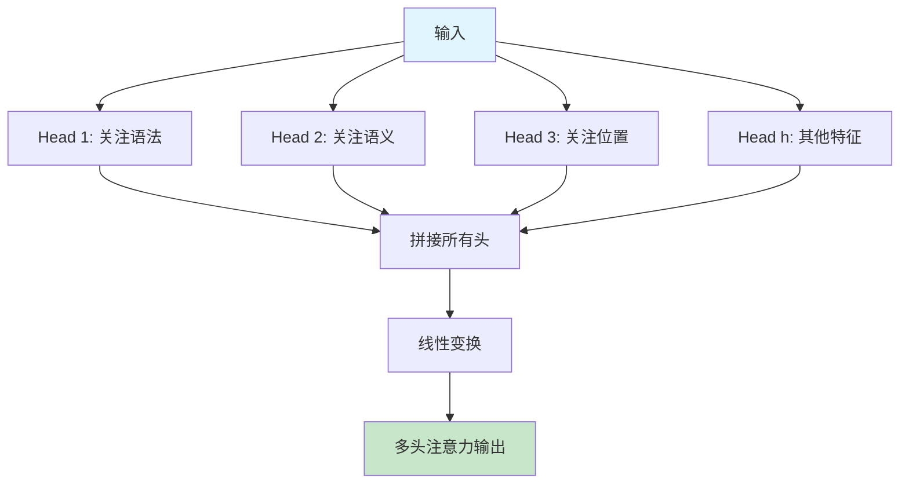

**🔍 多头注意力详解**

**为什么8个头或12个头？**
- 每个头关注不同的语言特征
- Head 1 可能关注主谓关系
- Head 2 可能关注修饰关系
- Head 3 可能关注时间关系
- 更多头 = 更丰富的特征表示

**计算过程: **


### 位置编码 (Positional Encoding)
**问题: ** Transformer 本身无法理解词的顺序
**解决: ** 给每个位置添加位置信息

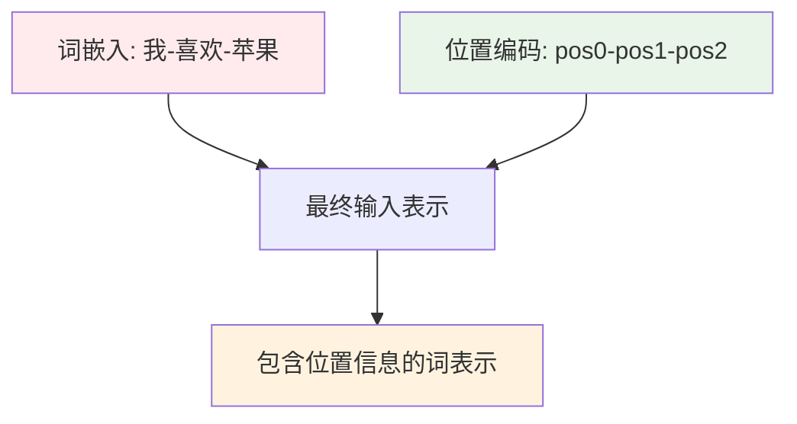

**🔍 位置编码详解**

**为什么需要位置编码？**
- "我喜欢苹果" 和 "苹果喜欢我" 意思完全不同
- 但对于 Transformer，这两个句子的词是相同的
- 位置编码告诉模型每个词在句子中的位置

**两种主要方式: **

**1. 正弦位置编码 (Sinusoidal)**
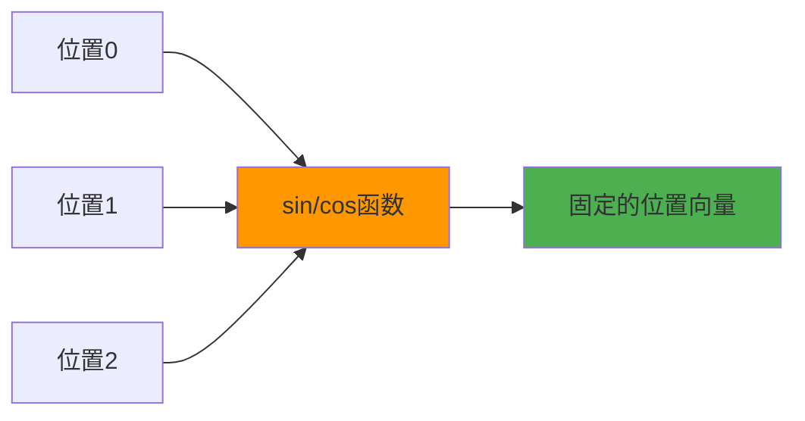

**2. 可学习位置编码 (Learned)**
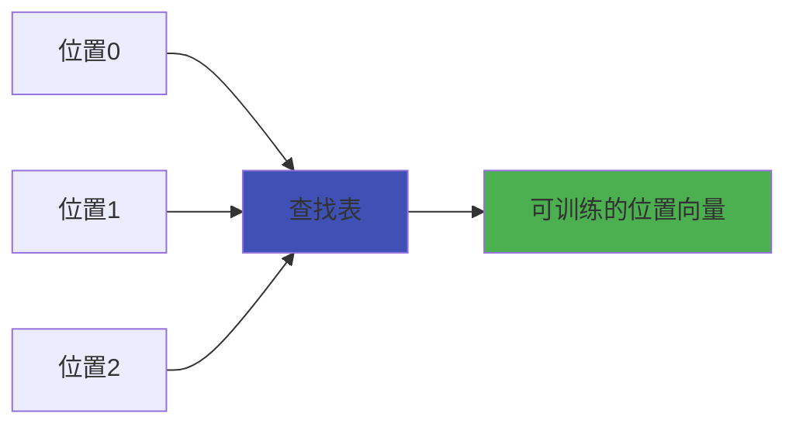

**实际效果: **
- 相邻位置的编码相似
- 距离越远，编码差异越大
- 模型能学会利用位置信息理解语序

---

## 🎮 互动学习: 理解注意力机制

### 注意力可视化示例
想象句子: **"小猫在阳台上晒太阳"**

当模型处理"晒"这个词时:
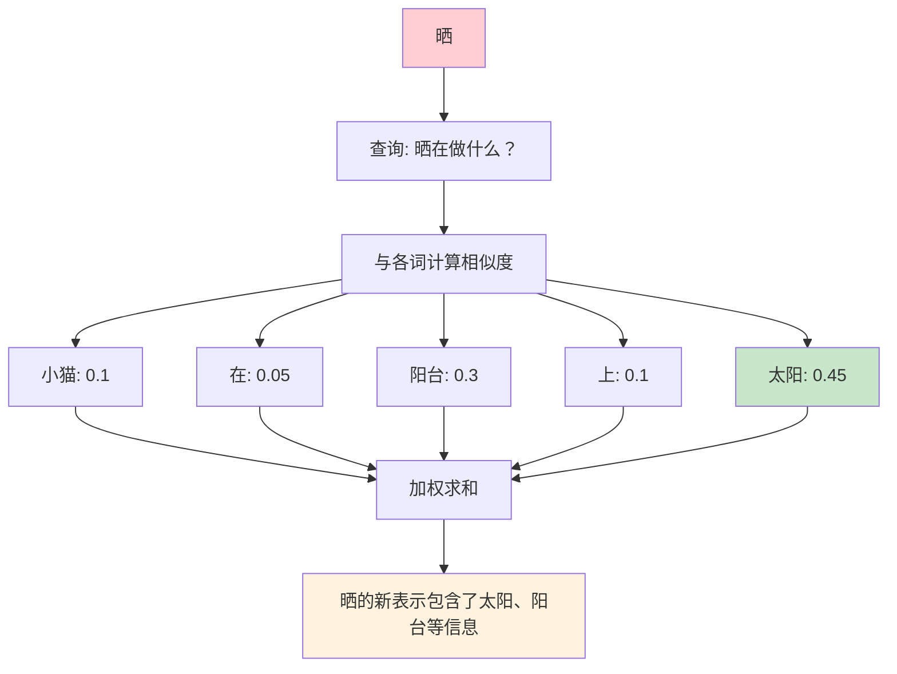

### 🧠 思考练习

**练习1: ** 在句子"我用手机给妈妈打电话"中，当处理"打"字时，哪些词应该获得更高的注意力权重？

<details>
<summary>点击查看答案</summary>

- "电话": 权重最高（动作对象）
- "手机": 权重较高（工具）
- "妈妈": 权重中等（接收者）
- "我": 权重较低（主语）
- "用"、"给": 权重很低（助词）

</details>

**练习2: ** 为什么多头注意力比单头更好？

<details>
<summary>点击查看答案</summary>

1. **信息多样性**: 不同头关注不同特征
2. **鲁棒性**: 某个头出错不会影响整体
3. **表达能力**: 能捕获更复杂的语言关系
4. **并行计算**: 多头可以同时计算

</details>

---

## 🛠️ 实战: 从零构建 Transformer

### 最小版本 Transformer 实现思路

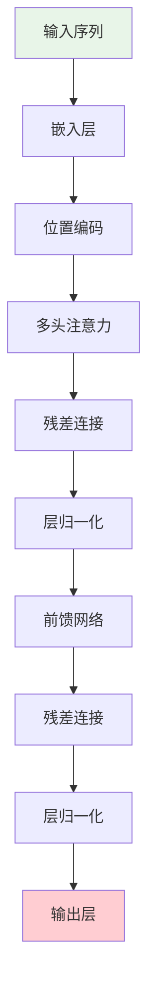

### 代码实现要点

**1. 注意力矩阵计算**
```python
# 伪代码示例
def attention(Q, K, V):
    # 计算注意力得分
    scores = Q @ K.T / sqrt(d_k)
    # 应用 softmax
    weights = softmax(scores)
    # 加权求和
    output = weights @ V
    return output
```

**2. 多头注意力**
```python
# 伪代码示例
def multi_head_attention(X):
    heads = []
    for i in range(num_heads):
        Q_i = X @ W_Q[i]
        K_i = X @ W_K[i]
        V_i = X @ W_V[i]
        head_i = attention(Q_i, K_i, V_i)
        heads.append(head_i)

    # 拼接所有头
    concat = concatenate(heads)
    # 线性变换
    output = concat @ W_O
    return output
```

---

## 📊 性能对比: 为什么 Transformer 更好？

### 与 RNN/LSTM 对比

| 特性 | RNN/LSTM | Transformer |
|------|----------|-------------|
| **并行计算** | ❌ 顺序计算 | ✅ 完全并行 |
| **长序列处理** | ❌ 梯度消失 | ✅ 直接连接 |
| **训练速度** | 🐌 慢 | 🚀 快 |
| **表达能力** | 🔵 中等 | 🟢 强 |
| **内存消耗** | 🟢 低 | 🔴 高 |

### 注意力机制的优势

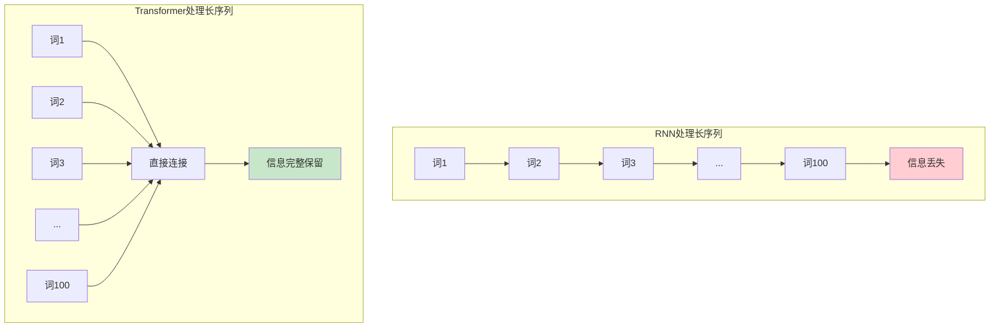

### Encoder-Only 模型
**代表: ** BERT
**用途: ** 文本理解、分类、问答


### Decoder-Only 模型
**代表: ** GPT
**用途: ** 文本生成、对话


### Encoder-Decoder 模型
**代表: ** T5, BART
**用途: ** 翻译、摘要、转换任务


---

## 🏆 学习进阶路线

### 初级阶段 (1-2周)
- [ ] 理解注意力机制基本原理
- [ ] 掌握 Q、K、V 矩阵的作用
- [ ] 了解多头注意力的优势
- [ ] 理解位置编码的必要性

**推荐实践: **
- 手工计算简单的注意力权重
- 绘制注意力热力图
- 对比不同位置编码方法

### 中级阶段 (2-3周)
- [ ] 深入理解残差连接和层归一化
- [ ] 掌握 Encoder-Decoder 架构
- [ ] 了解不同 Transformer 变体
- [ ] 学习掩码注意力机制

**推荐实践: **
- 实现简化版的 Transformer 层
- 训练小规模语言模型
- 分析不同头的注意力模式

### 高级阶段 (3-4周)
- [ ] 理解优化技巧（如 Flash Attention）
- [ ] 掌握长序列处理方法
- [ ] 了解 MoE 等高级架构
- [ ] 研究最新改进方法

**推荐实践: **
- 优化模型性能和内存使用
- 处理长文档任务
- 设计新的注意力变体

### 🎯 实战项目建议

**项目1: 情感分析器**
- 使用 BERT 进行文本分类
- 可视化注意力权重
- 分析模型决策过程

**项目2: 文本摘要系统**
- 使用 Encoder-Decoder 架构
- 实现 Beam Search 解码
- 评估生成质量

**项目3: 对话机器人**
- 基于 GPT 架构
- 实现上下文记忆
- 处理多轮对话

---

## 📚 经典论文阅读清单

### 必读论文 📖
1. **Attention Is All You Need** (2017)
    - 原始 Transformer 论文
    - 理解基础架构

2. **BERT: Pre-training of Deep Bidirectional Transformers** (2018)
    - Encoder-only 架构
    - 预训练-微调范式

3. **Language Models are Unsupervised Multitask Learners** (GPT-2, 2019)
    - Decoder-only 架构
    - 自回归生成模型

### 进阶论文 🚀
4. **RoFormer: Enhanced Transformer with Rotary Position Embedding** (2021)
    - 旋转位置编码
    - 改进位置表示

5. **Switch Transformer: Scaling to Trillion Parameter Models** (2021)
    - Mixture of Experts
    - 扩展模型容量

---

## 🔧 调试与优化技巧

### 常见问题诊断

**问题1: 注意力权重异常**


**解决方案: **
- 检查输入序列是否正确填充
- 验证注意力掩码是否合理
- 调整 softmax 温度参数

**问题2: 训练不收敛**
- 学习率过大或过小
- 梯度裁剪问题
- 初始化不当

**问题3: 内存不足**
- 使用梯度累积
- 减小批次大小
- 采用混合精度训练

### 性能优化策略

**计算优化: **
- 使用 Flash Attention
- 启用自动混合精度
- 优化批次大小

**内存优化: **
- 梯度检查点
- 参数高效微调
- 模型并行化

---

## 🎨 可视化工具推荐

### 注意力可视化
- **BertViz**: 交互式注意力可视化
- **Attention-viz**: 轻量级可视化工具
- **TensorBoard**: 训练过程监控

### 模型结构可视化
- **Netron**: 神经网络架构可视化
- **Graphviz**: 自定义图形生成
- **Matplotlib**: 自制可视化图表

---

## 🌟 总结: 掌握 Transformer 的关键

### 三个核心概念 🎯
1. **注意力机制**: 让模型知道"看哪里"
2. **多头设计**: 同时关注多个方面
3. **残差连接**: 保持信息流动

### 两个重要直觉 💡
1. **并行计算**: 不需要等待前面计算完成
2. **全局连接**: 任意两个位置都能直接交互

### 一个学习建议 📝
**从简单开始，逐步深入**:
先理解单头注意力 → 多头注意力 → 完整 Transformer → 各种变体

记住: **理解比记忆更重要，实践比理论更有效！**
