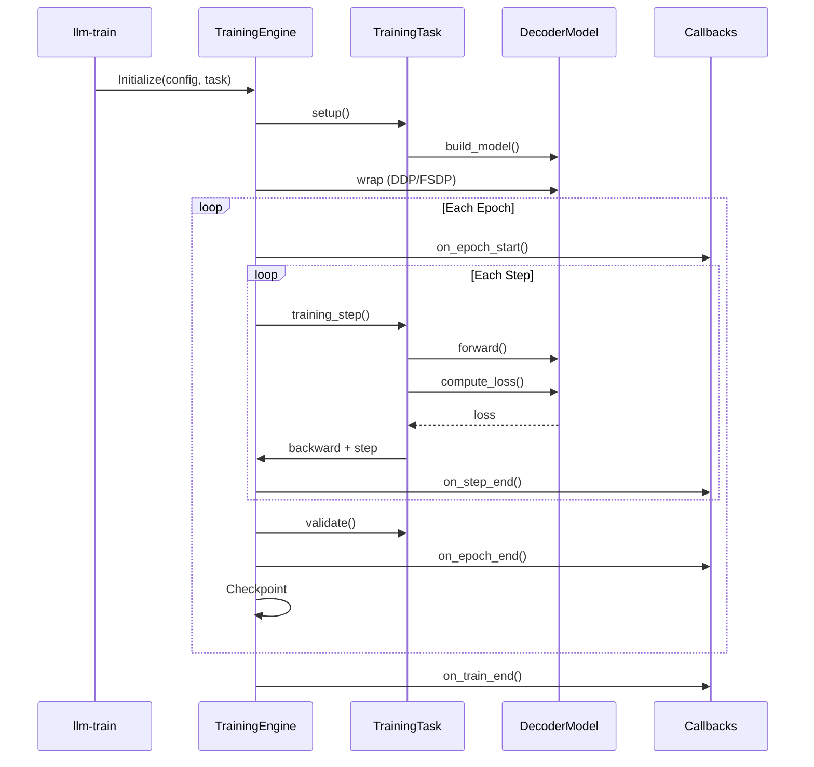

# `llm.training` — Training Detailed API

Training infrastructure including the engine, callbacks, configuration,
task definitions, and RLHF components.

## Configuration

The configuration system uses Pydantic models defined in
`src/llm/training/core/config.py`:

- **`Config`** — Root configuration model combining model, training,
  data, optimization, and distributed settings.
- **`ModelConfig`** — Architecture parameters (hidden size, number
  of heads/layers, attention implementation, etc.).
- **`TrainingConfig`** — Training hyperparameters (batch size,
  learning rate, epochs, optimizer settings).
- **`DataConfig`** — Dataset configuration (source type, tokenizer,
  max sequence length, steps per epoch).
- **`OptimizationConfig`** — Performance settings (AMP, compile,
  gradient checkpointing).
- **`DistributedConfig`** — DDP/FSDP settings (backend, world size).
- **`LoggingConfig`** — Log directory and verbosity.
- **`CheckpointConfig`** — Checkpoint directory, save interval,
  retention policy.

```python
from llm.training.core.config import Config, ModelConfig, TrainingConfig

config = Config.from_yaml("configs/streaming_c4.yaml")
print(config.model.hidden_size)
print(config.training.learning_rate)
```

## Callbacks

Callbacks provide hooks into the training loop at specific events.
Defined in `src/llm/training/core/callbacks.py`:

- **`Callback`** — Base class with `on_train_start`, `on_epoch_end`,
  `on_step_end`, etc.
- **`MetricsLogger`** — Logs metrics to console at configurable
  intervals.
- **`TensorBoardLogger`** — Writes scalars and histograms to
  TensorBoard event files.
- **`LRSchedulerCallback`** — Integrates PyTorch LR schedulers with
  warmup and logging.

```python
from llm.training.core.callbacks import Callback


class CustomLogger(Callback):
    def on_step_end(self, logs):
        if self.engine.rank == 0:
            print(f"Step {logs['global_step']}: loss={logs['loss']:.4f}")
```

## Checkpoint Manager

`CheckpointManager` (`src/llm/training/core/checkpoint.py`) handles:

- Saving model weights, optimizer state, and metadata.
- Keeping the last N checkpoints.
- Tracking the best checkpoint by validation loss.
- Loading checkpoints for resume.

## Distributed Utilities

`src/llm/training/core/distributed.py` provides:

- **`DistributedManager`** — Wrapper around `torch.distributed.init_process_group`
  with configurable backend (nccl, gloo).
- **`model_for_checkpoint_io`** — Wraps models for FSDP/DDP.
- **`wrap_model_for_training`** — Applies DDP/FSDP wrapping.

## Task System

Tasks bind a model architecture to data loading and the loss function.
The `TaskSpec` dataclass pairs a task class with a data module class.

### Task Registry

Defined in `src/llm/training/task_registry.py`:

- **`TASK_REGISTRY`** — Maps task names to `TaskSpec` instances.
- **`TaskSpec`** — Data class holding task class, data module factory,
  and metadata.

### Built-in Tasks

All registered in `src/llm/training/tasks/builtin.py`:

| Task Name    | Class                  | Data Module               | Description                    |
| ------------ | ---------------------- | ------------------------- | ------------------------------ |
| `lm`         | `LanguageModelingTask` | `TextDataModule`          | Map-style language modeling    |
| `stream_lm`  | `LanguageModelingTask` | `StreamingTextDataModule` | Streaming pretraining          |
| `sft`        | `SFTTask`              | `SFTDataModule`           | Supervised fine-tuning         |
| `dpo`        | `DPOTask`              | `DPODataModule`           | Direct preference optimization |
| `reward`     | `RewardTask`           | `RewardDataModule`        | Reward model training          |
| `ppo`        | `PPOTask`              | `PromptDataModule`        | PPO RLHF alignment             |
| `regression` | `RegressionTask`       | `SyntheticDataModule`     | Synthetic regression demo      |

### Task Base Class

`TrainingTask` (`src/llm/training/tasks/base_task.py`) requires:

- **`build_model()`** — Constructs the model from config.
- **`compute_loss()`** — Computes loss from model outputs.
- **`build_optimizer()`** — Creates the optimizer.
- **`build_scheduler()`** — Creates LR scheduler.
- **`evaluate()`** — Runs validation and returns metrics.

## RLHF Components

Defined in `src/llm/training/rlhf/`:

- **`PPOSingleProcessor`** — PPO trainer implementation.
- **`RolloutBuffer`** — Stores trajectories for PPO updates.
- **`ValueModel`** — Value head for PPO advantage estimation.

## CLI Entry Point

The training CLI (`llm.training.train`) provides:

```bash
llm-train --task <task_name> \
  --config-path <config.yaml> \
  --epochs <N> \
  --batch-size <N> \
  --lr <float>
```

Available tasks are dynamically registered via `TASK_REGISTRY`
(`src/llm/training/tasks/builtin.py`); the `--task` choices in
`llm-train --help` are the registered names.

CLI 覆盖只支持 `--epochs` / `--batch-size` / `--lr` / `--num-samples` /
`--steps-per-epoch` / `--compile` / `--amp`；resume / PEFT / checkpoint
路径等其余设置走 YAML（`checkpoint.resume_from_checkpoint` 等）。

## Key Training Flow


