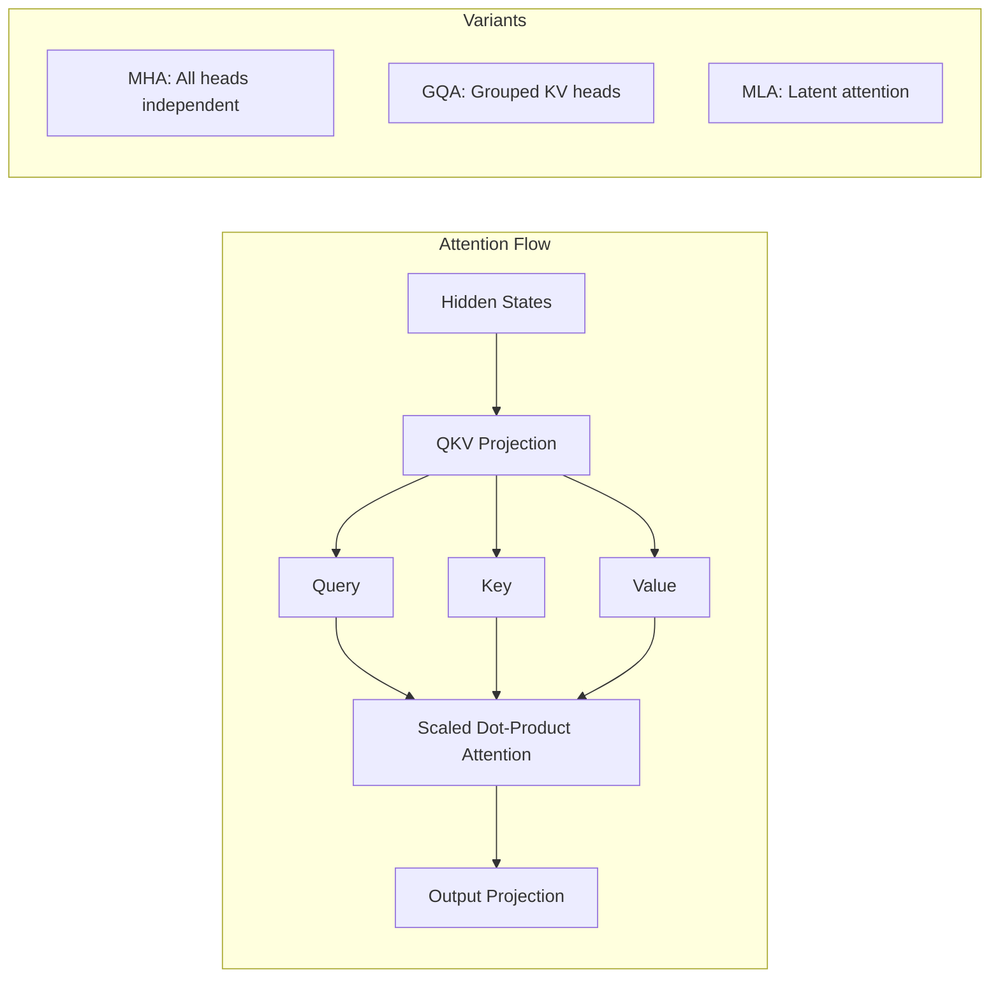
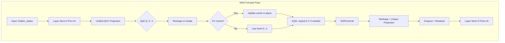
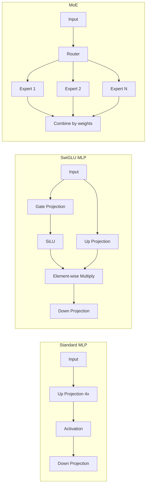
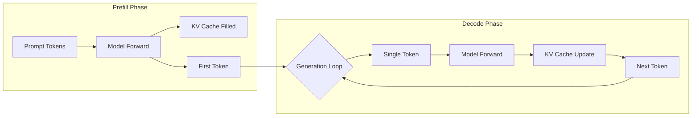
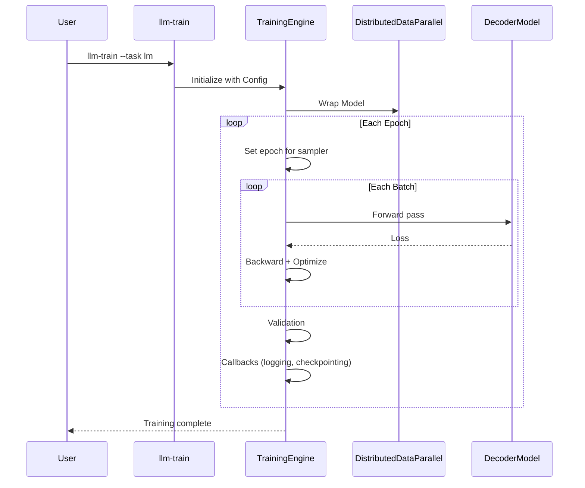

# Architecture Documentation

This document provides a deep dive into the architecture of the `llm` project, explaining its core design principles, component structure, and key abstractions.

## Design Philosophy

The project follows a **Modular & Composable** design philosophy:

* **src-layout**: Code is isolated in `src/` to prevent import layout confusion.
* **Separation of Concerns**:
    * `core`: Pure, reusable PyTorch modules (Attention, MLP, Norm).
    * `models`: Logic to assemble core components into full architectures (Decoder).
    * `training`: Orchestration of training loops, DDP, logging.
    * `serving`: High-performance inference API (FastAPI).
* **Registry Pattern**: Core components are decoupled and selectable via configuration.
* **Configuration as Code**: Pydantic models define type-safe, validating configurations.

## Directory Structure

```text
src/llm/
├── core/                    # Reusable PyTorch modules
│   ├── attn/               # Attention mechanisms (MHA, MLA, SDPA)
│   ├── embedding.py        # Token + positional embeddings (RoPE, ALiBi)
│   ├── lora.py            # LoRA adapters
│   ├── qlora.py           # QLoRA with NF4 quantization
│   ├── kv_cache.py        # Pre-allocated KV cache
│   ├── mlp.py             # Standard MLP with SwiGLU
│   ├── moe.py             # Mixture of Experts
│   ├── norm.py            # RMSNorm, LayerNorm
│   ├── registry.py        # Component registry
│   └── transformer_block.py
├── models/                 # Complete model architectures
│   └── decoder.py         # Decoder-only transformer
├── training/              # Training infrastructure
│   ├── core/              # Engine, callbacks, config
│   ├── data/              # DataModules, tokenizers
│   └── tasks/             # Task-specific trainers (LM, SFT)
├── serving/               # Inference API
│   └── api.py             # FastAPI with OpenAI-compatible endpoints
└── inference.py           # Generation utilities
```

## System Overview

```mermaid
graph TD
    Config[Configuration (Pydantic)] --> Training[Training Engine]
    Config --> Serving[Serving Engine]

    subgraph "Core Layers (src/llm/core)"
        Reg[Registry]
        MHA[MultiHeadAttention]
        MLP[MLP / MoE]
        Norm[RMSNorm / LayerNorm]
    end

    subgraph "Data Abstraction (src/llm/data)"
        Tokenizer[BaseTokenizer / HFTokenizer]
        Dataset[TextDataset]
        DataModule[TextDataModule]
    end

    subgraph "Models (src/llm/models)"
        Decoder[DecoderModel]
    end

    Reg --> MHA
    Reg --> MLP

    Training --> DataModule
    Training --> Decoder

    DataModule --> Tokenizer
    Dataset --> Tokenizer

    Decoder --> MHA
    Decoder --> MLP
    Decoder --> Norm
```

## Core Components & Registry

To support rapid experimentation with different architectural variants (e.g., Flash Attention, SwiGLU, MoE), we employ a **Registry Pattern**.

### Component Registry

Located in `src/llm/core/registry.py`, registries allow dynamic selection of implementations:

* **`ATTENTION_REGISTRY`**: `mha` (Standard), `flash` (Planned)
* **`MLP_REGISTRY`**: `mlp` (Standard), `moe` (Mixture of Experts)
* **`NORM_REGISTRY`**: `layer_norm`, `rms_norm`

Components register themselves via decorators:

```python
@ATTENTION_REGISTRY.register("mha")
class MultiHeadAttention(nn.Module): ...
```

Configuration controls which implementation is used:

```yaml
model:
  attn_impl: "mha"
  mlp_impl: "moe"
```

## Data Abstraction

The project decouples data loading from tokenization logic to support both simple character-level experiments and production-grade HuggingFace tokenizers.

### Tokenizer Hierarchy

* **`BaseTokenizer` (Protocol)**: Defines the interface (`encode`, `decode`, `vocab_size`).
* **`SimpleCharacterTokenizer`**: A lightweight, dependency-free tokenizer for basic testing.
* **`HFTokenizer`**: A wrapper around `transformers.AutoTokenizer`, enabling access to the entire HuggingFace ecosystem.

### Data Module

`TextDataModule` uses `DataConfig` to determine which tokenizer to load and how to process the dataset.

## Configuration System

All configuration is managed via Pydantic models in `src/llm/training/core/config.py`, offering:

* **Type Safety**: Automatic type validation.
* **Environment Variables**: Override via `LLM_MODEL__HIDDEN_SIZE=1024`.
* **CLI Integration**: `Typer` automatically exposes these configs as command-line arguments.

### Config Structure

* **`ModelConfig`**: Architecture params (`hidden_size`, `num_layers`, `attn_impl`).
* **`DataConfig`**: Data params (`tokenizer_type`, `dataset_path`).
* **`TrainingConfig`**: loop params (`epochs`, `lr`).
* **`DistributedConfig`**: DDP params (`master_addr`, `world_size`).
* **`OptimizationConfig`**: performance (`use_compile`, `use_amp`).

## Attention Mechanism

The project supports multiple attention variants through the registry pattern:



### Supported Features

| Feature | Description |
| ------- | ----------- |
| **GQA** | Multiple query heads share KV heads (memory efficient) |
| **Sliding Window** | Limits attention scope for long sequences |
| **KV Cache** | Caches key/value for autoregressive generation |
| **RoPE** | Rotary position embeddings with scaling |
| **ALiBi** | Attention with linear biases |

### Multi-Head Attention Internals

The `MultiHeadAttention` class (`src/llm/core/attn/mha.py`) implements:



**Key Design Decisions**:

1. **Unified QKV Projection**: Single linear layer for Q, K, V improves memory throughput
2. **Pre-LN Default**: More stable gradients for deep networks
3. **SDPA Backend**: Uses `torch.nn.functional.scaled_dot_product_attention` for Flash Attention when available

### MLP / MoE Architecture



## Data Flow Analysis

### Training Data Flow

```mermaid
graph LR
    subgraph "Data Pipeline"
        Raw[Raw Text] --> Tok[Tokenizer]
        Tok --> DS[TextDataset]
        DS --> DL[DataLoader]
        DL --> Batch[Collated Batch]
    end

    subgraph "Model Forward"
        Batch --> Emb[Embedding + RoPE]
        Emb --> Blocks[N x TransformerBlock]
        Blocks --> Norm[Final Norm]
        Norm --> LMHead[LM Head]
        LMHead --> Logits
    end

    subgraph "Loss & Backward"
        Logits --> CE[Cross-Entropy Loss]
        CE --> Grad[Gradients]
        Grad --> Opt[Optimizer Step]
    end
```



### Inference Data Flow



## Training Pipeline


