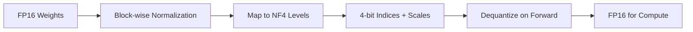

# Fine-Tuning Guide

This guide covers parameter-efficient fine-tuning methods available in the LLM framework.

## Overview

| Method | Memory | Use Case |
| ------ | ------ | -------- |
| **Full Fine-Tuning** | 100% | Small models, abundant GPU |
| **LoRA** | ~10% | General PEFT, good balance |
| **QLoRA** | ~5% | Large models, limited GPU |

## LoRA (Low-Rank Adaptation)

LoRA adds trainable low-rank matrices to frozen linear layers, reducing trainable parameters by 90%+.

### Basic Usage

```python
from llm.models import DecoderModel
from llm.core.lora import apply_lora, get_lora_parameters, merge_lora

# 1. Create/load model
model = DecoderModel(vocab_size=32000, hidden_size=768, num_layers=12)

# 2. Apply LoRA
apply_lora(
    model,
    rank=8,           # Low-rank dimension
    alpha=16.0,       # Scaling factor
    dropout=0.1,      # Regularization
    target_modules=["qkv_proj", "out_proj"],  # Which layers to adapt
)

# 3. Train with LoRA parameters only
optimizer = torch.optim.AdamW(get_lora_parameters(model), lr=1e-4)

# 4. For inference: merge weights
merge_lora(model)  # LoRA weights merged into base, no extra latency
```

### Configuration Tips

| Parameter | Recommendation |
| --------- | -------------- |
| `rank` | 4-16 for most tasks, higher for complex tasks |
| `alpha` | Usually 2x rank (e.g., rank=8 → alpha=16) |
| `target_modules` | QKV + Output projections in attention |

---

## QLoRA (Quantized LoRA)

QLoRA combines 4-bit quantization with LoRA for extreme memory efficiency.

### Basic Usage

```python
from llm.core.qlora import apply_qlora, get_qlora_parameters

# Apply QLoRA (base weights quantized to 4-bit NF4)
apply_qlora(
    model,
    rank=8,
    alpha=16.0,
    block_size=64,    # Quantization block size
)

# Train
optimizer = torch.optim.AdamW(get_qlora_parameters(model), lr=1e-4)
```

### Memory Comparison

For a 7B parameter model:

| Method | Base Weights | Trainable | Total VRAM |
| ------ | ------------ | --------- | ---------- |
| Full FT | 14GB (fp16) | 14GB | ~28GB |
| LoRA | 14GB (fp16) | 0.1GB | ~14GB |
| QLoRA | 3.5GB (4-bit) | 0.1GB | ~4GB |

### How NF4 Quantization Works



NF4 (Normal Float 4-bit) uses 16 carefully chosen quantization levels optimized for normally distributed weights.

---

## Best Practices

### 1. Choose the Right Method

- **LoRA**: When you have 1-2 GPUs with 16-24GB VRAM
- **QLoRA**: When memory is severely limited (8GB GPU) or model is very large (13B+)

### 2. Target Module Selection

For transformer models, prioritize:

1. `qkv_proj` / `q_proj`, `k_proj`, `v_proj` (attention queries/keys/values)
2. `out_proj` (attention output)
3. Linear layers in MLP (optional, diminishing returns)

### 3. Hyperparameters

```python
# Conservative start
apply_lora(model, rank=4, alpha=8)

# More capacity if underfitting
apply_lora(model, rank=16, alpha=32)

# With regularization for small datasets
apply_lora(model, rank=8, alpha=16, dropout=0.1)
```

### 4. Saving and Loading

```python
# Save only LoRA weights (small file)
lora_state = {name: p for name, p in model.named_parameters() if p.requires_grad}
torch.save(lora_state, "lora_weights.pt")

# Load: first apply_lora, then load weights
apply_lora(model, rank=8, alpha=16)
model.load_state_dict(torch.load("lora_weights.pt"), strict=False)
```

---

## API Reference

### LoRA Functions

| Function | Description |
| -------- | ----------- |
| `apply_lora(model, ...)` | Apply LoRA to model |
| `merge_lora(model)` | Merge LoRA into base weights |
| `unmerge_lora(model)` | Undo merge |
| `get_lora_parameters(model)` | Get trainable params |
| `disable_lora(model)` | Temporarily disable |
| `enable_lora(model)` | Re-enable |

### QLoRA Functions

| Function | Description |
| -------- | ----------- |
| `apply_qlora(model, ...)` | Apply QLoRA (quantizes base) |
| `get_qlora_parameters(model)` | Get trainable params |
| `quantize_nf4(tensor)` | Manual NF4 quantization |
| `dequantize_nf4(indices, scales, ...)` | Dequantize NF4 |
