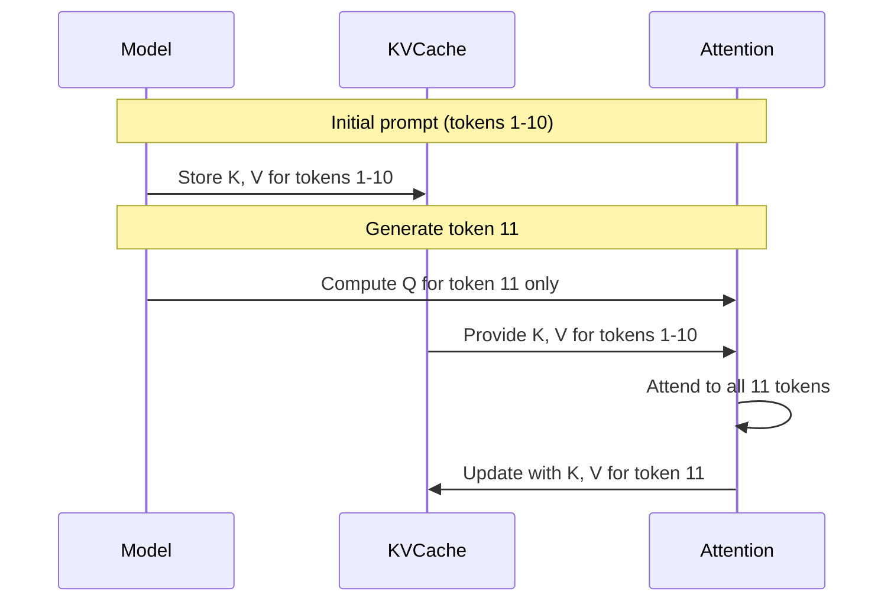

# Inference Optimization Guide

This guide covers techniques for optimizing inference performance in the LLM framework.

## KV Cache

KV Cache stores computed key and value tensors during autoregressive generation, avoiding redundant computation.

### How It Works



Without cache: O(n²) attention per token
With cache: O(n) attention per token

### Pre-Allocated KVCache

The `KVCache` class provides efficient, pre-allocated buffers:

```python
from llm.core.kv_cache import KVCache

# Create cache for inference
cache = KVCache(
    max_batch_size=1,
    max_seq_len=512,      # Maximum generation length
    num_kv_heads=8,       # From model config
    head_dim=64,          # hidden_size / num_heads
    device="cuda",
    dtype=torch.float16,
)

# For multi-layer models, create one per layer
caches = KVCache.from_model_config(
    max_batch_size=1,
    max_seq_len=512,
    num_layers=12,
    num_kv_heads=8,
    head_dim=64,
    device="cuda",
    dtype=torch.float16,
)
```

### Using with DecoderModel

```python
from llm.core.kv_cache import KVCache, reset_all_caches

# Create caches
caches = KVCache.from_model_config(
    max_batch_size=1,
    max_seq_len=512,
    num_layers=model.num_layers,
    num_kv_heads=model.num_kv_heads,
    head_dim=model.hidden_size // model.num_heads,
    device=device,
    dtype=model.dtype,
)

# Generation loop
input_ids = tokenizer.encode("Hello, world!")

for _ in range(max_new_tokens):
    # Forward with cache (caches updated in-place)
    logits = model(input_ids, kv_caches=caches, use_cache=True)

    # Get next token
    next_token = logits[:, -1, :].argmax(dim=-1, keepdim=True)
    input_ids = next_token  # Only pass new token for next step

# Reset for new sequence
reset_all_caches(caches)
```

### Memory Benefits

| Approach | Memory Pattern | Fragmentation |
| -------- | -------------- | ------------- |
| `torch.cat` (legacy) | Grows each step | High |
| `KVCache` (pre-alloc) | Fixed upfront | None |

---

## Continuous Batching

For high-throughput serving, use the `ContinuousBatchingEngine` which supports iteration-level scheduling.

### Engine Setup

```python
from llm.serving.engine import ContinuousBatchingEngine
from llm.models.decoder import DecoderModel
from llm.tokenization.simple_tokenizer import SimpleCharacterTokenizer

# Load model and tokenizer
model = DecoderModel(
    vocab_size=32000,
    hidden_size=512,
    num_layers=6,
    num_heads=8,
    max_seq_len=512,
)
tokenizer = SimpleCharacterTokenizer(["a", "b", "c"])

# Create engine (model and tokenizer required upfront)
engine = ContinuousBatchingEngine(
    model=model,
    tokenizer=tokenizer,
    device="cuda",
    max_batch_size=16,
    max_seq_len=512,
)
```

### Request Processing

```python
from llm.serving.schemas import GenerationRequest

# Add requests
req1 = GenerationRequest(prompt="Hello", max_new_tokens=50)
req2 = GenerationRequest(prompt="World", max_new_tokens=50)
engine.add_request(req1)
engine.add_request(req2)

# Run inference steps
while engine.scheduler.has_pending_work:
    engine.step()  # One iteration handles all active sequences
```

### Key Features

| Feature | Description |
| ------- | ----------- |
| Iteration-level scheduling | Multiple requests processed per step |
| Slot-based KV cache | Pre-allocated memory pool |
| Mixed prefill/decode | New and ongoing sequences batched together |
| Automatic padding | Handles variable-length inputs |

## Grouped Query Attention (GQA)

GQA reduces KV cache memory by sharing KV heads across multiple query heads.

```text
MHA:  Q=32, K=32, V=32  (32 KV pairs)
GQA:  Q=32, K=8,  V=8   (8 KV pairs, 4x memory reduction)
MQA:  Q=32, K=1,  V=1   (1 KV pair, 32x memory reduction)
```

### Configuration

```python
model = DecoderModel(
    hidden_size=1024,
    num_heads=16,         # Query heads
    num_kv_heads=4,       # KV heads (GQA: 4:1 ratio)
)
```

---

## Sliding Window Attention

Limits attention to recent tokens only, reducing memory for very long sequences.

```python
model = DecoderModel(
    hidden_size=512,
    num_heads=8,
    window_size=256,  # Only attend to last 256 tokens
)
```

### Trade-offs

| Window Size | Memory | Long-range Recall |
| ----------- | ------ | ----------------- |
| 128 | Very low | Limited |
| 512 | Low | Good |
| 2048 | Medium | Excellent |
| None | High | Full |

---

## Inference Checklist

1. ✅ **Use KVCache** for autoregressive generation
2. ✅ **Enable GQA** if model supports it (check num_kv_heads)
3. ✅ **Consider sliding window** for very long sequences
4. ✅ **Use appropriate dtype** (fp16/bf16 for GPU)
5. ✅ **Merge LoRA weights** before inference (`merge_lora()`)

---

## Performance Comparison

| Technique | Latency | Memory | Quality |
| --------- | ------- | ------ | ------- |
| Baseline | 1.0x | 1.0x | 100% |
| + KVCache | 0.3x | ~1.0x | 100% |
| + GQA (4:1) | 0.25x | 0.25x | ~99% |
| + Sliding Window | 0.2x | 0.15x | ~95%* |

*Quality depends on task; long-range dependencies may suffer.
