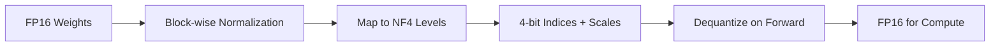

# Fine-Tuning Guide

This guide covers parameter-efficient fine-tuning methods available in the LLM framework. All methods are accessible through a unified PEFT_REGISTRY and share a common configuration interface.

## Overview

The framework supports 8 PEFT methods through the unified `PEFT_REGISTRY`:

| Method               | Trainable Params | Memory      | Merge Support      | Best For                    |
| -------------------- | ---------------- | ----------- | ------------------ | --------------------------- |
| **LoRA**             | ~10%             | ~1.1x base  | Yes                | General PEFT                |
| **QLoRA**            | ~0.5%            | ~0.25x base | No (quantized)     | Extreme memory saving       |
| **AdaLoRA**          | ~10%             | ~1.1x base  | Yes                | Adaptive rank allocation    |
| **IA3**              | ~0.01%           | ~1.0x base  | Yes                | Multi-task, lightweight     |
| **BitFit**           | ~0.1%            | ~1.0x base  | N/A (bias only)    | Fast ablation, baseline     |
| **Adapter**          | ~5%              | ~1.05x base | Yes                | Classic PEFT benchmark      |
| **Pfeiffer Adapter** | ~2.5%            | ~1.03x base | Yes                | Parameter-efficient adapter |
| **Prefix Tuning**    | ~1%              | ~1.01x base | No (prefix tokens) | Instruction tuning          |

---

## LoRA (Low-Rank Adaptation)

LoRA adds trainable low-rank matrices to frozen linear layers, reducing trainable parameters by 90%+.

### Basic Usage

```python
from llm.models import DecoderModel
from llm.core.lora import apply_lora, get_lora_parameters, merge_lora

# 1. Create/load model
model = DecoderModel(vocab_size=32000, hidden_size=768, num_layers=12)

# 2. Apply LoRA
apply_lora(
    model,
    rank=8,  # Low-rank dimension
    alpha=16.0,  # Scaling factor
    dropout=0.1,  # Regularization
    target_modules=["qkv_proj", "out_proj"],  # Which layers to adapt
)

# 3. Train with LoRA parameters only
optimizer = torch.optim.AdamW(get_lora_parameters(model), lr=1e-4)

# 4. For inference: merge weights
merge_lora(model)  # LoRA weights merged into base, no extra latency
```

### Configuration Tips

| Parameter        | Recommendation                                |
| ---------------- | --------------------------------------------- |
| `rank`           | 4-16 for most tasks, higher for complex tasks |
| `alpha`          | Usually 2x rank (e.g., rank=8 -> alpha=16)    |
| `target_modules` | QKV + Output projections in attention         |

---

## QLoRA (Quantized LoRA)

QLoRA combines 4-bit quantization with LoRA for extreme memory efficiency.

### Basic Usage

```python
from llm.core.qlora import apply_qlora, get_qlora_parameters

# Apply QLoRA (base weights quantized to 4-bit NF4)
apply_qlora(
    model,
    rank=8,
    alpha=16.0,
    block_size=64,  # Quantization block size
)

# Train
optimizer = torch.optim.AdamW(get_qlora_parameters(model), lr=1e-4)
```

### Memory Comparison

For a 7B parameter model:

| Method  | Base Weights  | Trainable | Total VRAM |
| ------- | ------------- | --------- | ---------- |
| Full FT | 14GB (fp16)   | 14GB      | ~28GB      |
| LoRA    | 14GB (fp16)   | 0.1GB     | ~14GB      |
| QLoRA   | 3.5GB (4-bit) | 0.1GB     | ~4GB       |

### How NF4 Quantization Works



NF4 (Normal Float 4-bit) uses 16 carefully chosen quantization levels optimized for normally distributed weights.

---

## AdaLoRA (Adaptive Low-Rank Adaptation)

AdaLoRA extends LoRA with SVD-form parameterization, orthogonal regularization, and adaptive rank pruning. Instead of a fixed rank, AdaLoRA learns the importance of each singular value and prunes less important ones during training.

### Key Concepts

- **SVD Parameterization**: Each LoRA module is parameterized as `A * diag(s) * B` (full SVD form) rather than `A * B` (low-rank form), enabling the model to learn the importance of each rank dimension.
- **Orthogonal Regularization**: Penalizes deviation from orthogonality in the left/right singular vectors, preventing redundancy and collapse.
- **Adaptive Pruning**: An EMA-based importance tracker monitors singular values during training. Less important ranks are progressively pruned via a callback, leaving an optimally sparse adapter.

### Basic Usage

```python
from llm.core.adalora import apply_adalora

apply_adalora(
    model,
    rank=16,  # Initial rank (will be pruned adaptively)
    alpha=32.0,  # Scaling factor
    target_modules=["qkv_proj", "out_proj"],
    init_warmup=100,  # Steps before pruning begins
    final_warmup=500,  # Steps to reach final budget
    delta_t=10,  # Frequency of importance evaluation
    reg_value=0.1,  # Orthogonal regularization coefficient
)

# Use with the AdaLoRA pruning callback during training
from llm.core.adalora import AdaLoRACallback

callback = AdaLoRACallback(model)
# Pass callback to your training loop; it prunes ranks adaptively
```

### Configuration Tips

| Parameter     | Recommendation                                     |
| ------------- | -------------------------------------------------- |
| `rank`        | Start higher than target (e.g., 16-32)             |
| `init_warmup` | 1-5% of total steps for burn-in                    |
| `alpha`       | 2x initial rank                                    |
| `reg_value`   | 0.05-0.2; higher = stronger orthogonal constraint  |

---

## IA3 (Infused Adapter by Inhibiting and Amplifying Activations)

IA3 is an extremely lightweight PEFT method that learns multiplicative scaling vectors per layer. Each adapted layer has exactly `out_features` trainable parameters -- typically less than 0.01% of the full model.

### Key Concepts

- **Multiplicative PEFT**: Rather than adding parallel low-rank pathways (LoRA), IA3 learns a single scaling vector that element-wise multiplies the layer output.
- **Identity Initialization**: Scaling vectors are initialized to ones (identity transform), so the model starts from the pre-trained behavior and diverges only when beneficial.
- **No Wrapper Needed**: IA3 modifies existing layers in-place without adding wrapper modules. There is nothing to merge -- the scaling vectors are trivially folded into the layer during inference if desired.

### Basic Usage

```python
from llm.core.ia3 import apply_ia3

apply_ia3(
    model,
    init_scale=1.0,  # Initialization value (default identity)
    target_modules=["qkv_proj", "out_proj", "mlp"],  # Supports any linear layer
)

# Only scaling vectors are trainable
optimizer = torch.optim.AdamW(
    [p for n, p in model.named_parameters() if "ia3_scaling" in n],
    lr=1e-3,
)
```

### Configuration Tips

| Parameter        | Recommendation                              |
| ---------------- | ------------------------------------------- |
| `init_scale`     | 1.0 (identity). Values >1 amplify, <1 gate  |
| `target_modules` | Apply to all linear layers for best results |
| Learning rate    | Typically 1e-3 to 5e-3 (higher than LoRA)   |

---

## BitFit (Bias-only Fine-Tuning)

BitFit is the simplest PEFT method: it only trains the bias parameters of the model. All weight matrices remain frozen. There are no wrappers, no new parameters, and nothing to merge.

### Key Concepts

- **Bias-Only Training**: Only parameters named `"bias"` (or custom bias-like parameters) are set to trainable. This is the lightest possible PEFT method.
- **No Wrapper, No Merge**: BitFit operates directly on the existing model structure. Since bias parameters are part of the original layer, there is no separate adapter to save, load, or merge.
- **Fast Ablation Baseline**: Because the number of trainable parameters is so small, BitFit is ideal as a baseline or for sanity-checking data quality before committing to a heavier PEFT method.

### Basic Usage

```python
from llm.core.bitfit import apply_bitfit

apply_bitfit(
    model,
    target_modules=["qkv_proj", "out_proj", "mlp"],  # Which modules to unfreeze biases on
)
```

### Configuration Tips

| Parameter        | Recommendation                                      |
| ---------------- | --------------------------------------------------- |
| `target_modules` | Apply to all modules for maximum capacity           |
| Learning rate    | 1e-3 to 5e-3 (often needs higher LR than LoRA)      |
| Use case         | Sanity-check data, fast ablation studies, baselines |

---

## Adapter (Houlsby 2019)

The Houlsby adapter inserts bottleneck residual modules into each transformer layer. Each adapter consists of a down-projection (Kaiming-initialized), a nonlinearity, and an up-projection (zero-initialized), combined with a residual connection.

### Key Concepts

- **Bottleneck Architecture**: `d_model -> bottleneck_dim -> d_model`. The down-projection compresses the hidden dimension, and the up-projection restores it.
- **Kaiming Down, Zero Up**: The down-projection uses Kaiming uniform initialization. The up-projection is zero-initialized, so the adapter starts as the identity function (residual is zero).
- **Residual Connection**: The adapter output is added back to the input, ensuring the pre-trained function is preserved at initialization.

### Basic Usage

```python
from llm.core.adapter import apply_adapter

apply_adapter(
    model,
    bottleneck_dim=128,  # Bottleneck size (< hidden_dim)
    target_modules=["qkv_proj", "out_proj", "mlp"],
    dropout=0.1,
)
```

### Configuration Tips

| Parameter       | Recommendation                                      |
| --------------- | --------------------------------------------------- |
| `bottleneck_dim`| 64-256; trade-off between params and capacity       |
| `target_modules`| Attention + MLP layers for full Houlsby formulation |
| `dropout`       | 0.05-0.2 for regularization                         |

---

## Pfeiffer Adapter

The Pfeiffer adapter is a lightweight variant of the Houlsby adapter that targets only the FFN (MLP) layers of the transformer. It reuses the same `AdapterLinear` wrapper but applies it to half the modules, using approximately half the parameters of the full Houlsby variant.

### Key Concepts

- **FFN-Only Adaptation**: The adapter is inserted only after the MLP sublayer. The attention sublayer is left untouched.
- **Shared Wrapper**: Reuses the same `AdapterLinear` bottleneck module from the Houlsby implementation, ensuring consistent behavior and checkpoint compatibility.
- **Parameter Efficiency**: ~2.5% trainable parameters vs. ~5% for full Houlsby adapter, making it suitable for extremely parameter-constrained scenarios.

### Basic Usage

```python
from llm.core.pfeiffer import apply_pfeiffer_adapter

apply_pfeiffer_adapter(
    model,
    bottleneck_dim=64,  # Smaller bottleneck than Houlsby
    dropout=0.1,
)
```

### Configuration Tips

| Parameter        | Recommendation                                       |
| ---------------- | ---------------------------------------------------- |
| `bottleneck_dim` | 32-128; smaller than Houlsby due to lighter need     |
| `dropout`        | 0.05-0.15                                            |
| Use case         | When ~half the parameters of full Adapter is desired |

---

## Prefix Tuning

Prefix Tuning learns a set of virtual prefix tokens that are prepended to the keys and values in each attention layer. Unlike adapter-based methods which modify the computation pathway, prefix tuning conditions the attention mechanism by inserting learned pseudo-tokens.

### Key Concepts

- **Virtual Prefix Tokens**: A small set of learnable vectors (prefix length, typically 10-50 tokens) is prepended to the key and value sequences at every attention layer.
- **Attention Backend Agnostic**: Works with all attention implementations: MHA (Multi-Head Attention), Flash Attention, and MLA (Multi-Head Latent Attention).
- **No Weights to Merge**: Prefix tokens are a separate learnable embedding that is always applied at the attention level. There are no weights to merge into the base model.
- **Non-Destructive**: The base model weights remain completely unchanged, making prefix tuning trivially composable with other adapters.

### Basic Usage

```python
from llm.core.prefix import apply_prefix_tuning

apply_prefix_tuning(
    model,
    prefix_length=20,  # Number of virtual prefix tokens
    target_modules=["qkv_proj"],  # Typically only attention projections
    reparam=32,  # Reparameterization hidden size (MLP bottleneck)
)
```

### Configuration Tips

| Parameter        | Recommendation                                           |
| ---------------- | -------------------------------------------------------- |
| `prefix_length`  | 10-30 for most tasks; 50+ for complex instruction tuning |
| `target_modules` | Typically `qkv_proj` or equivalent attention modules     |
| `reparam`        | 16-64; larger = more capacity, more params               |

---

## Unified PEFT Configuration

All eight PEFT methods share the same YAML configuration interface. Switch between methods by changing `peft_method` and providing method-specific arguments under `peft_kwargs`.

### YAML Configuration

```yaml
training:
  peft_method: lora  # Switch to: ia3, bitfit, adapter, pfeiffer_adapter, prefix_tuning, adalora
  peft_kwargs:
    rank: 8
    alpha: 16.0
    dropout: 0.1
    target_modules: ["qkv_proj", "out_proj"]
  peft_save_path: checkpoints/peft_adapter.bin
```

### Method-Specific Examples

```yaml
# AdaLoRA
training:
  peft_method: adalora
  peft_kwargs:
    rank: 16
    alpha: 32.0
    target_modules: ["qkv_proj", "out_proj"]
    init_warmup: 100
    final_warmup: 500
    delta_t: 10
    reg_value: 0.1
  peft_save_path: checkpoints/adalora_adapter.bin

# IA3
training:
  peft_method: ia3
  peft_kwargs:
    ia3_init_scale: 1.0
    ia3_target_modules: ["qkv_proj", "out_proj", "mlp"]
  peft_save_path: checkpoints/ia3_adapter.bin

# BitFit
training:
  peft_method: bitfit
  peft_kwargs:
    bitfit_target_modules: ["qkv_proj", "out_proj", "mlp"]
  peft_save_path: checkpoints/bitfit_adapter.bin

# Houlsby Adapter
training:
  peft_method: adapter
  peft_kwargs:
    bottleneck_dim: 128
    dropout: 0.1
    adapter_target_modules: ["qkv_proj", "out_proj", "mlp"]
  peft_save_path: checkpoints/adapter.bin

# Pfeiffer Adapter
training:
  peft_method: pfeiffer_adapter
  peft_kwargs:
    bottleneck_dim: 64
    dropout: 0.1
  peft_save_path: checkpoints/pfeiffer_adapter.bin

# Prefix Tuning
training:
  peft_method: prefix_tuning
  peft_kwargs:
    prefix_length: 20
    prefix_target_modules: ["qkv_proj"]
  peft_save_path: checkpoints/prefix_tuning.bin
```

### Python API

All methods are also accessible programmatically through the registry:

```python
from llm.core.peft import PEFT_REGISTRY, apply_peft

# Option 1: Use the apply_peft convenience function
apply_peft(model, "adalora", rank=16, alpha=32.0)

# Option 2: Look up a method and call apply directly
method_cls = PEFT_REGISTRY["adalora"]
method_cls.apply(model, rank=16, alpha=32.0)
```

The `PEFT_REGISTRY` maps method names to their corresponding `PEFTMethod` dataclass instances, each exposing a consistent `apply()` interface. Methods are registered from the built-in implementations and can be extended via third-party plugins through the `llm.peft_methods` setuptools entry-point group.

---

## PEFT Method Comparison

### Trainable Parameters Breakdown

For a 7B parameter model with `hidden_dim=4096`:

| Method               | Trainable Params | % of Total | Memory Overhead |
| -------------------- | ---------------- | ---------- | --------------- |
| Full Fine-Tuning     | 7B               | 100%       | ~28GB           |
| LoRA (r=8)           | ~35M             | ~0.5%      | ~14.1GB         |
| QLoRA (r=8, 4-bit)   | ~35M             | ~0.5%      | ~4GB            |
| AdaLoRA (r=16)       | ~70M             | ~1%        | ~14.2GB         |
| IA3                  | ~0.7M            | ~0.01%     | ~14GB           |
| BitFit               | ~7M              | ~0.1%      | ~14GB           |
| Adapter (d=128)      | ~350M            | ~5%        | ~14.7GB         |
| Pfeiffer (d=64)      | ~175M            | ~2.5%      | ~14.4GB         |
| Prefix Tuning (l=20) | ~70M             | ~1%        | ~14.1GB         |

### When to Use Each Method

| Scenario                                  | Recommended Method          |
| ----------------------------------------- | --------------------------- |
| General-purpose fine-tuning               | LoRA                        |
| Memory constrained (<8GB GPU)             | QLoRA                       |
| Automatic rank allocation / pruning       | AdaLoRA                     |
| Multi-task serving with many adapters     | IA3                         |
| Quick baseline or data sanity check       | BitFit                      |
| Classic benchmark comparison              | Adapter (Houlsby)           |
| Extremely parameter-efficient adapter     | Pfeiffer Adapter            |
| Instruction tuning / conditioning         | Prefix Tuning               |

---

## PEFT Checkpoint Management

### Automatic Checkpointing

The `PEFTAdapterCheckpointCallback` automatically saves adapter weights at the end of training. It is registered by default when any PEFT method is active.

```python
from llm.training.core.callbacks import PEFTAdapterCheckpointCallback

callback = PEFTAdapterCheckpointCallback(
    peft_method="lora",
    peft_kwargs={"rank": 8, "alpha": 16.0},
    peft_save_path="checkpoints/peft_adapter.bin",
)
```

The callback produces a sidecar file containing only the adapter weights, typically megabytes in size (vs. gigabytes for a full model checkpoint). On failure, the error is logged but not re-raised -- the main checkpoint has already been written, and losing the sidecar is recoverable.

### Manual Save and Load

```python
from llm.peft import save_peft, load_peft

# Save adapter weights
save_peft(model, "checkpoints/my_adapter.bin")

# Load adapter weights
# If the model doesn't already have the PEFT method applied,
# load_peft auto-applies it using the saved peft_kwargs
load_peft(model, "checkpoints/my_adapter.bin")
```

### Checkpoint Format

Adapter save files use a versioned envelope with positional parameter keys (used instead of named keys because the structural identity of adapter parameters is unstable across processes):

```python
{
    "format_version": "1.0",
    "method_name": "lora",
    "peft_kwargs": {"rank": 8, "alpha": 16.0},
    "state_dict": {
        "lora.0": tensor,    # Positional index, not named
        "lora.1": tensor,
        ...
    },
}
```

The `format_version` field enables forward and backward compatibility across framework releases. An unknown version is rejected on load.

### Cross-Method Compatibility

Adapter checkpoints are specific to the method they were saved with. Loading an IA3 checkpoint onto a LoRA-wrapped model will raise an error. Verify method match:

```python
from llm.peft import get_peft_method

method = get_peft_method(model)  # Returns "lora", "adalora", etc.
```

### File Size Comparison

For a 7B model:

| Checkpoint Type      | Typical Size |
| -------------------- | ------------ |
| Full model (fp16)    | ~14 GB       |
| Full model (int8)    | ~7 GB        |
| LoRA adapter (r=8)   | ~70 MB       |
| IA3 adapter          | ~1.4 MB      |
| BitFit               | ~14 MB       |
| Adapter (d=128)      | ~700 MB      |

Adapter sidecar files are orders of magnitude smaller than full checkpoints, enabling cheap storage, versioning, and sharing.

---

## Serving with PEFT

Loaded adapters can be mounted on base models during inference via `llm-serve`. Adapters are hot-swappable without reloading the base model.

Configure serving through environment variables:

```bash
# Mount a LoRA adapter on startup（llm-serve 只读环境变量，没有 --config 参数）
LLM_SERVING_MODEL_PATH=checkpoints_sft_alpaca/epoch_3 \
LLM_SERVING_PEFT_METHOD=lora \
LLM_SERVING_PEFT_ADAPTER_PATH=checkpoints/lora_adapter.bin \
LLM_SERVING_API_KEY=$(openssl rand -hex 32) \
uv run llm-serve
```

See the [Inference Guide](inference.md) for detailed instructions on serving with PEFT adapters, including multi-adapter routing, adapter hot-swapping at runtime, and batching with heterogeneous adapters.

---

## Best Practices

### 1. Choose the Right Method

- **LoRA**: When you have 1-2 GPUs with 16-24GB VRAM
- **QLoRA**: When memory is severely limited (8GB GPU) or model is very large (13B+)
- **AdaLoRA**: When you want automatic rank allocation without manual tuning
- **IA3**: When serving many fine-tuned variants from a single base model
- **BitFit**: For rapid prototyping or establishing a lower bound
- **Prefix Tuning**: For instruction-style conditioning without modifying weights

### 2. Target Module Selection

For transformer models, prioritize:

1. `qkv_proj` / `q_proj`, `k_proj`, `v_proj` (attention queries/keys/values)
2. `out_proj` (attention output)
3. Linear layers in MLP (optional, diminishing returns)

### 3. Hyperparameters

```python
# Conservative start (LoRA)
apply_lora(model, rank=4, alpha=8)

# More capacity if underfitting
apply_lora(model, rank=16, alpha=32)

# With regularization for small datasets
apply_lora(model, rank=8, alpha=16, dropout=0.1)

# Adaptive rank (AdaLoRA) - start higher, let pruning decide
apply_adalora(model, rank=16, alpha=32, init_warmup=100, final_warmup=500)

# Lightweight multi-task (IA3)
apply_ia3(model, init_scale=1.0)

# Bias-only baseline (BitFit)
apply_bitfit(model)

# Bottleneck adapter (Houlsby)
apply_adapter(model, bottleneck_dim=128, dropout=0.1)

# FFN-only adapter (Pfeiffer)
apply_pfeiffer_adapter(model, bottleneck_dim=64, dropout=0.1)

# Prefix tuning for instruction conditioning
apply_prefix_tuning(model, prefix_length=20, reparam=32)
```

### 4. Saving and Loading

```python
# Save only adapter weights (small file)
from llm.core.peft import save_peft

save_peft(model, "peft_adapter.bin")

# Load: if the model doesn't have the PEFT method yet,
# load_peft auto-applies it using the saved peft_kwargs
from llm.core.peft import load_peft

load_peft(model, "peft_adapter.bin")
```

---

## API Reference

### LoRA Functions

| Function                     | Description                  |
| ---------------------------- | ---------------------------- |
| `apply_lora(model, ...)`     | Apply LoRA to model          |
| `merge_lora(model)`          | Merge LoRA into base weights |
| `unmerge_lora(model)`        | Undo merge                   |
| `get_lora_parameters(model)` | Get trainable params         |
| `disable_lora(model)`        | Temporarily disable          |
| `enable_lora(model)`         | Re-enable                    |

### QLoRA Functions

| Function                               | Description                  |
| -------------------------------------- | ---------------------------- |
| `apply_qlora(model, ...)`              | Apply QLoRA (quantizes base) |
| `get_qlora_parameters(model)`          | Get trainable params         |
| `quantize_nf4(tensor)`                 | Manual NF4 quantization      |
| `dequantize_nf4(indices, scales, ...)` | Dequantize NF4               |

### AdaLoRA Functions

| Function                             | Description                          |
| ------------------------------------ | ------------------------------------ |
| `apply_adalora(model, ...)`          | Apply AdaLoRA (SVD-form) to model    |
| `AdaLoRACallback(model, ...)`        | Pruning callback for adaptive rank   |
| `get_adalora_parameters(model)`      | Get trainable params                 |
| `merge_adalora(model)`               | Merge AdaLoRA into base weights      |

### IA3 Functions

| Function                         | Description                       |
| -------------------------------- | --------------------------------- |
| `apply_ia3(model, ...)`          | Apply IA3 scaling vectors to model|
| `get_ia3_parameters(model)`      | Get trainable params              |
| `merge_ia3(model)`               | Fold scaling vectors into weights |

### BitFit Functions

| Function                   | Description                    |
| -------------------------- | ------------------------------ |
| `apply_bitfit(model, ...)` | Freeze all non-bias parameters |

### Adapter Functions

| Function                               | Description                          |
| -------------------------------------- | ------------------------------------ |
| `apply_adapter(model, ...)`            | Apply Houlsby bottleneck adapters    |
| `apply_pfeiffer_adapter(model, ...)`   | Apply Pfeiffer FFN-only adapters     |
| `get_adapter_parameters(model)`        | Get trainable params                 |
| `merge_adapter(model)`                 | Merge adapter into base weights      |

### Prefix Tuning Functions

| Function                                 | Description                          |
| ---------------------------------------- | ------------------------------------ |
| `apply_prefix_tuning(model, ...)`        | Apply prefix token embeddings        |
| `get_prefix_parameters(model)`           | Get trainable params                 |

### Unified PEFT Registry

| Function / Class                      | Description                                   |
| ------------------------------------- | --------------------------------------------- |
| `PEFT_REGISTRY`                       | Dict mapping method names to modules          |
| `apply_peft(model, method, **kwargs)` | Apply any registered PEFT method              |
| `merge_peft(model)`                   | Merge active PEFT adapter (if supported)      |
| `save_peft(model, path)`              | Save adapter weights with format envelope     |
| `load_peft(model, path)`              | Load adapter weights (auto-applies if needed) |
| `get_peft_method(model)`              | Detect which PEFT method is applied           |
| `PEFTAdapterCheckpointCallback`       | Auto-save callback for training               |
