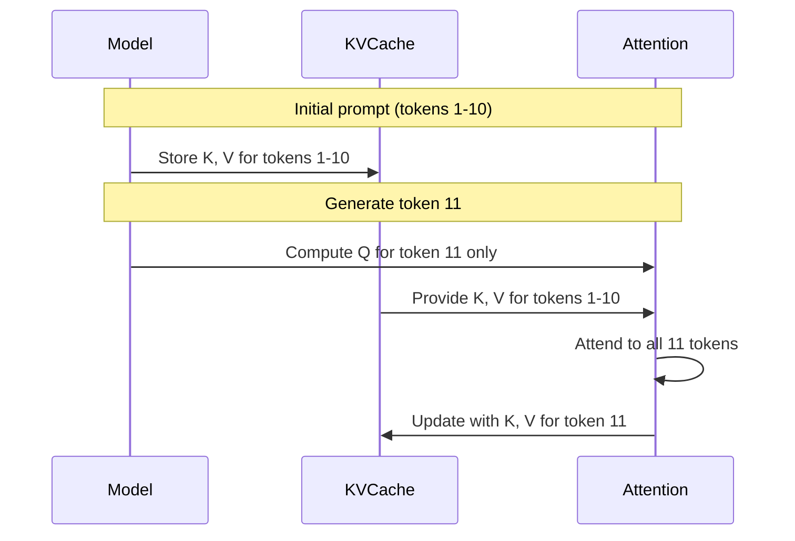

# Inference Optimization Guide

This guide covers techniques for optimizing inference performance in the LLM framework.

## KV Cache

KV Cache stores computed key and value tensors during autoregressive generation, avoiding redundant computation.

### How It Works



Without cache: O(n²) attention per token
With cache: O(n) attention per token

### Pre-Allocated KVCache

The `KVCache` class provides efficient, pre-allocated buffers:

```python
from llm.core.kv_cache import KVCache

# Create cache for inference
cache = KVCache(
    max_batch_size=1,
    max_seq_len=512,      # Maximum generation length
    num_kv_heads=8,       # From model config
    head_dim=64,          # hidden_size / num_heads
    device="cuda",
    dtype=torch.float16,
)

# For multi-layer models, create one per layer
caches = KVCache.from_model_config(
    max_batch_size=1,
    max_seq_len=512,
    num_layers=12,
    num_kv_heads=8,
    head_dim=64,
    device="cuda",
    dtype=torch.float16,
)
```

### Using with DecoderModel

```python
from llm.core.kv_cache import KVCache, reset_all_caches

# Create caches
caches = KVCache.from_model_config(
    max_batch_size=1,
    max_seq_len=512,
    num_layers=model.num_layers,
    num_kv_heads=model.num_kv_heads,
    head_dim=model.hidden_size // model.num_heads,
    device=device,
    dtype=model.dtype,
)

# Generation loop
input_ids = tokenizer.encode("Hello, world!")

for _ in range(max_new_tokens):
    # Forward with cache (caches updated in-place)
    logits = model(input_ids, kv_caches=caches, use_cache=True)

    # Get next token
    next_token = logits[:, -1, :].argmax(dim=-1, keepdim=True)
    input_ids = next_token  # Only pass new token for next step

# Reset for new sequence
reset_all_caches(caches)
```

### Memory Benefits

| Approach              | Memory Pattern  | Fragmentation |
| --------------------- | --------------- | ------------- |
| `torch.cat` (legacy)  | Grows each step | High          |
| `KVCache` (pre-alloc) | Fixed upfront   | None          |

---

## Continuous Batching

For high-throughput serving, use the `ContinuousBatchingEngine` which supports iteration-level scheduling.

### Engine Setup

```python
from llm.serving.batch_engine import ContinuousBatchingEngine
from llm.models.decoder import DecoderModel
from llm.tokenization.simple_tokenizer import SimpleCharacterTokenizer

# Load model and tokenizer
model = DecoderModel(
    vocab_size=32000,
    hidden_size=512,
    num_layers=6,
    num_heads=8,
    max_seq_len=512,
)
tokenizer = SimpleCharacterTokenizer(["a", "b", "c"])

# Create engine (model and tokenizer required upfront)
engine = ContinuousBatchingEngine(
    model=model,
    tokenizer=tokenizer,
    device="cuda",
    max_batch_size=16,
    max_seq_len=512,
)
```

### Request Processing

```python
from llm.serving.schemas import GenerationRequest

# Add requests
req1 = GenerationRequest(prompt="Hello", max_new_tokens=50)
req2 = GenerationRequest(prompt="World", max_new_tokens=50)
engine.add_request(req1)
engine.add_request(req2)

# Run inference steps
while engine.scheduler.has_pending_work:
    engine.step()  # One iteration handles all active sequences
```

### Key Features

| Feature                    | Description                                |
| -------------------------- | ------------------------------------------ |
| Iteration-level scheduling | Multiple requests processed per step       |
| Slot-based KV cache        | Pre-allocated memory pool                  |
| Mixed prefill/decode       | New and ongoing sequences batched together |
| Automatic padding          | Handles variable-length inputs             |

### Async Lifecycle (T2 #23)

Since the T2 #23 refactor, the engine exposes two complementary APIs:

- `engine.step()` — synchronous, for scripts / tests.
- `engine.step_async()` — asynchronous wrapper for FastAPI handlers.

Both APIs decompose into three phases:

```
[lock]  _lock_step_pre       — slot alloc, prefix-cache lookup,
                              batch tensor construction
[free]  _forward_and_sample  — model forward + sampling (expensive)
[lock]  _lock_step_post      — append tokens, free slots, set status
```

The lock is **released during the model forward** so other workers
can pre-/post-compute in parallel. `step_async` offloads the forward
to a thread via `asyncio.to_thread(...)`, letting the FastAPI
event loop keep serving health checks, `/metrics` scrapes, and other
in-flight requests while a forward pass runs.

```python
# Async usage in a FastAPI handler
from fastapi.concurrency import run_in_threadpool

async def stream_one(prompt: str):
    while True:
        stats = await engine.step_async()
        # ... yield decoded token to the client ...
```

The `StepStats(scheduled, total_active_slots)` returned by either
path feeds the `llm_batch_fill_ratio` gauge (see
[Serving Metrics](#serving-metrics-prometheus)).

## Serving Metrics (Prometheus)

`prometheus-fastapi-instrumentator` already emits generic HTTP RED
metrics (rate, errors, duration) per route. The serving tier also
publishes domain-specific metrics so operators can see what the model
is actually doing — not just that the route returned 200.

All metrics live in `src/llm/serving/metrics.py` and are exposed at
`/metrics` alongside the HTTP RED metrics.

### Metrics reference

| Metric                            | Type      | Labels             | Source                                         |
| --------------------------------- | --------- | ------------------ | ---------------------------------------------- |
| `llm_tokens_generated_total`      | Counter   | `endpoint`         | observed per successful generation             |
| `llm_tokens_per_request`          | Histogram | `endpoint`         | distribution of completion tokens (16/64/256/1024/4096 buckets) |
| `llm_request_duration_seconds`    | Histogram | `endpoint`, `status` | end-to-end request duration (0.05/0.25/1/5/30 buckets) |
| `llm_batch_fill_ratio`            | Gauge     | —                  | `ContinuousBatchingEngine.set_step_observer` callback |
| `llm_kv_cache_hit_ratio`          | Gauge     | —                  | set by callers observing prefix-cache hits     |
| `llm_inflight_requests`           | Gauge     | —                  | incremented while a request holds the semaphore |

Endpoints contributing to the `endpoint` label: `generate`,
`batch_generate`, `chat_completions`.

### Example PromQL queries

```promql
# p95 latency per endpoint (seconds)
histogram_quantile(0.95,
  sum by (le, endpoint) (rate(llm_request_duration_seconds_bucket[5m]))
)

# Throughput (tokens / second) by endpoint
sum by (endpoint) (rate(llm_tokens_generated_total[1m]))

# Batch utilization — fraction of slots in use over time
avg_over_time(llm_batch_fill_ratio[5m])

# Saturation signal — sustained near-100% fill with rising p95
# means the engine is throughput-bound.
llm_batch_fill_ratio > 0.8
  and
histogram_quantile(0.95,
  sum by (le) (rate(llm_request_duration_seconds_bucket[5m]))
) > 10

# KV-cache hit rate — fraction of prefix lookups served from cache
avg_over_time(llm_kv_cache_hit_ratio[10m])
```

### Wiring a custom observer

The engine's `set_step_observer(callback)` hook fires once per
`engine.step()` under the step lock, with the latest `StepStats`. Use
it to publish gauges (e.g. slot utilization) or to drive
adaptive batching decisions:

```python
from llm.serving.batch_engine import ContinuousBatchingEngine
from llm.serving.metrics import METRICS

engine = ContinuousBatchingEngine.from_serving_config(config, model, tokenizer)
engine.set_step_observer(METRICS.record_batch_fill_ratio)
```

Pass `None` to clear a previously installed observer.

### Startup configuration log line

On `lifespan` startup, the server emits one structured JSON line tagged
`event: server_config`. This is the canonical record of *what is actually
running* — useful for incident triage when the question is "which model
is on this box?" or "is prefix cache actually on?".

The line is emitted once via `_log_server_config` in `src/llm/serving/api.py`,
keyed on `event="server_config"` so it is greppable and Prometheus-style
log shippers can route on it without parsing free-form text.

Example (CPU dummy model, no API key):

```json
{"event": "server_config", "model_class": "DecoderModel",
 "param_count_total": 113125, "param_count_trainable": 113125,
 "dtype": "torch.float32", "device": "cpu",
 "max_seq_len": 128, "attn_impl": "mha", "mlp_impl": "mlp",
 "generation_backend": "eager", "enable_prefix_cache": false,
 "use_paged_attention": false, "api_key_set": false}
```

Fields:

| Field                    | Notes                                                              |
| ------------------------ | ------------------------------------------------------------------ |
| `model_class`            | `type(model).__name__` — `DecoderModel` for built-in, custom for third-party |
| `param_count_total`      | every parameter (trainable + frozen)                               |
| `param_count_trainable`  | `requires_grad=True` only — useful sanity check that PEFT froze the base |
| `dtype` / `device`       | from the first parameter; `"unknown"` if the model has none        |
| `max_seq_len`            | from `ServingConfig.max_seq_len`                                   |
| `attn_impl` / `mlp_impl` | registry keys (`mha` / `mlp` for built-ins; custom values for plugins) |
| `generation_backend`     | `eager` / `batched` / `speculative` — which backend loop is in use |
| `enable_prefix_cache`    | bool                                                               |
| `use_paged_attention`    | bool                                                               |
| `api_key_set`            | bool ONLY — the key value itself is never logged                   |

Operators normally grep for this line:

```bash
# Tail server logs and pull only the startup config line
uv run llm-serve 2>&1 | tee /tmp/llm-serve.log | grep '"event": "server_config"'

# Re-extract from a saved log file
grep '"event": "server_config"' /var/log/llm-serve.log | tail -1 | jq .
```

The `api_key_set` field intentionally carries the **presence** of an
API key, never its value — see `src/llm/serving/auth.py:52` for the
`hmac.compare_digest` timing-safe comparison.

## Grouped Query Attention (GQA)

GQA reduces KV cache memory by sharing KV heads across multiple query heads.

```text
MHA:  Q=32, K=32, V=32  (32 KV pairs)
GQA:  Q=32, K=8,  V=8   (8 KV pairs, 4x memory reduction)
MQA:  Q=32, K=1,  V=1   (1 KV pair, 32x memory reduction)
```

### Configuration

```python
model = DecoderModel(
    hidden_size=1024,
    num_heads=16,         # Query heads
    num_kv_heads=4,       # KV heads (GQA: 4:1 ratio)
)
```

---

## Sliding Window Attention

Limits attention to recent tokens only, reducing memory for very long sequences.

```python
model = DecoderModel(
    hidden_size=512,
    num_heads=8,
    window_size=256,  # Only attend to last 256 tokens
)
```

### Trade-offs

| Window Size | Memory   | Long-range Recall |
| ----------- | -------- | ----------------- |
| 128         | Very low | Limited           |
| 512         | Low      | Good              |
| 2048        | Medium   | Excellent         |
| None        | High     | Full              |

---

## Flash Attention 2 (opt-in)

For Ampere / Hopper hardware, the project exposes an explicit Flash
Attention 2 backend through `ATTENTION_REGISTRY` as `attn_impl="flash_attn"`.
It is **opt-in** because `flash-attn` ships CUDA wheels only and
should not be a hard runtime dependency.

### Install

```bash
# uv
uv sync --group perf

# pip
pip install 'llm[perf]'
# or, on a CUDA host:
pip install flash-attn
```

### Configuration

```python
from llm.models.decoder import DecoderModel

model = DecoderModel(
    vocab_size=32000,
    hidden_size=1024,
    num_layers=12,
    num_heads=16,
    attn_impl="flash_attn",  # uses FlashAttention when CUDA is available
)
```

If `flash-attn` is not installed, the registry entry still resolves
but constructing the module raises a clear `ImportError` pointing to
the install command. CPU-only hosts should keep the default
`attn_impl="mha"`.

### Trade-offs vs. `mha`

| Aspect            | `mha` (default)    | `flash_attn`            |
| ----------------- | ------------------ | ----------------------- |
| Backend           | `torch.nn.functional.scaled_dot_product_attention` | `flash_attn.flash_attn_func` |
| Custom attn_mask  | Supported          | **Not supported** — falls back via the engine layer if you need padding masks |
| Sliding window    | Supported (PyTorch SDPA) | Not supported yet (`flash_attn_varlen_func` is a future-work path) |
| Hardware          | CPU + CUDA + MPS   | CUDA only               |
| Long-context perf | O(S²) memory peaks | Streaming softmax, O(S) memory |

For training or long-context decode on supported hardware, prefer
`flash_attn`. For variable-length sequences with padding masks, stick
with `mha` until `flash_attn_varlen_func` lands (see Tier 3 follow-up).

---

## Publishing models to HuggingFace Hub

The reverse of `compat/hf_loader.from_pretrained` is in
`compat/hf_publisher.py`. Trained `DecoderModel`s can be saved
locally in HF-compatible format and pushed to a Hub repo, so the
model is loadable by **both** this project and HF's transformers.

### Install

```bash
# uv
uv sync --group compat

# pip
pip install 'llm[compat]'
# or, directly:
pip install safetensors huggingface_hub
```

### Save locally

```python
from llm.compat.hf_publisher import save_pretrained
from llm.models.decoder import DecoderModel

model = DecoderModel(
    vocab_size=32000, hidden_size=4096, num_layers=32, num_heads=32,
    attn_impl="mha", mlp_impl="mlp", use_glu=True,
)
# ... train model ...

save_pretrained(model, save_directory="./my-llm")
# → writes config.json + model.safetensors (Llama-shaped)
```

### Push to Hub

```bash
# one-time auth (uses HF_TOKEN env var)
huggingface-cli login
```

```python
from llm.compat.hf_publisher import push_to_hub

push_to_hub(
    model,
    repo_id="alice/my-llm",
    private=False,
    commit_message="Initial upload",
)
# Returns "https://huggingface.co/alice/my-llm"
```

### Roundtrip guarantee

`save_pretrained` writes a directory that the existing
`from_pretrained` can load back into an equivalent model. The
q/k/v split + concat, plus `fc1` ↔ `up_proj` / `fc2` ↔ `down_proj`
translation, is exercised in
`tests/compat/test_hf_publisher.py::test_save_pretrained_roundtrip_through_from_pretrained`.

### Limitations (Tier 3 follow-ups)

- Only `architecture="llama"` is wired through. Qwen/Mistral
  architectures are recognized by `detect_architecture` but the
  publisher raises `ValueError`. Full support lands with the
  FSDP-e2e + multi-arch work (Tier 3 #2).
- Tokenizer artifacts are not yet auto-saved alongside the model.
  Bundle them with `tokenizer.save_pretrained(save_directory)`
  before pushing, or open a follow-up.

---

## Speculative decoding

For long-context decode on large target models, speculative decoding
(Leviathan et al., 2023) can give 2–3× throughput. A small **draft**
model speculates `gamma` candidate tokens ahead of the large
**target** model; the target scores all candidates in a single
forward pass and either accepts (probabilistically, preserving the
target distribution) or samples a correction token.

### Configuration

```python
from llm.generation.backends import SpeculativeDecodingBackend

backend = SpeculativeDecodingBackend(
    target_model=target,   # the "expensive" model
    draft_model=draft,     # smaller model, same vocab
    gamma=5,               # speculative tokens per round
)

# Or via the registry:
from llm.generation.registry import get_generation_backend
backend = get_generation_backend(
    "speculative",
    target_model=target,
    draft_model=draft,
    gamma=5,
)
```

### When it helps

| Scenario | Speedup? |
|---|---|
| Long-context decode (≥ 256 tokens), draft well-aligned with target | ✓ 2–3× typical |
| Short prompts (< 32 tokens) | ✗ overhead dominates |
| Draft very different from target (e.g., mixed-model families) | ✗ acceptance rate collapses |
| Greedy decoding | Marginal — most tokens already accepted in eager mode |

### Sampling

Speculative decoding is **distribution-preserving**: sampling from
`SpeculativeDecodingBackend` with the same `temperature` / `top_k` /
`top_p` as the eager backend produces text from the same
distribution as the target model alone. Greedy
(`temperature=0.0`) makes the draft's argmax match the target's
argmax on every accepted position, so all `gamma` tokens are
accepted and one bonus is appended per round.

### Limitations

- Both models must share vocabulary. The draft is not auto-trained
  — pick a smaller sibling or distill the target.
- The current slice runs the **eager** algorithm (each round
  rebuilds the context tensor). Wiring it into
  `ContinuousBatchingEngine` for serving-tier concurrency is a
  Tier 3 follow-up.

---

## Inference Checklist

1. ✅ **Use KVCache** for autoregressive generation
2. ✅ **Enable GQA** if model supports it (check num_kv_heads)
3. ✅ **Consider sliding window** for very long sequences
4. ✅ **Use appropriate dtype** (fp16/bf16 for GPU)
5. ✅ **Consider Flash Attention 2** on Ampere/Hopper (`attn_impl="flash_attn"`)
6. ✅ **Merge LoRA weights** before inference (`merge_lora()`)

---

## Performance Comparison

| Technique        | Latency | Memory | Quality |
| ---------------- | ------- | ------ | ------- |
| Baseline         | 1.0x    | 1.0x   | 100%    |
| + KVCache        | 0.3x    | ~1.0x  | 100%    |
| + GQA (4:1)      | 0.25x   | 0.25x  | ~99%    |
| + Sliding Window | 0.2x    | 0.15x  | ~95%*   |

*Quality depends on task; long-range dependencies may suffer.
