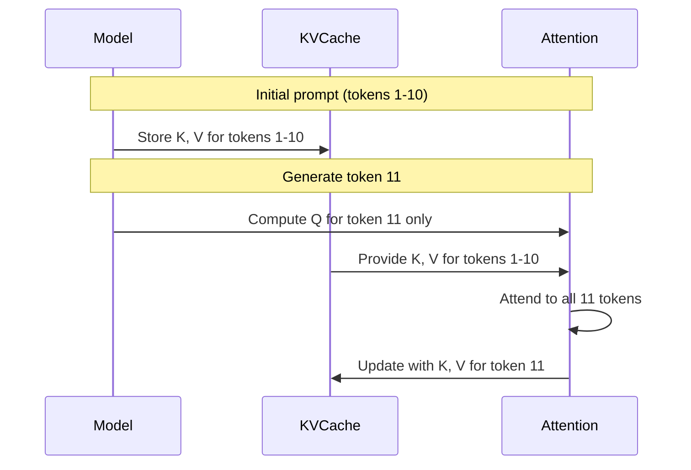

# Inference Optimization Guide

This guide covers techniques for optimizing inference performance in the LLM framework.

## KV Cache

KV Cache stores computed key and value tensors during autoregressive generation, avoiding redundant computation.

### How It Works



Without cache: O(n²) attention per token
With cache: O(n) attention per token

### Pre-Allocated KVCache

The `KVCache` class provides efficient, pre-allocated buffers:

```python
from llm.core.kv_cache import KVCache

# Create cache for inference
cache = KVCache(
    max_batch_size=1,
    max_seq_len=512,      # Maximum generation length
    num_kv_heads=8,       # From model config
    head_dim=64,          # hidden_size / num_heads
    device="cuda",
    dtype=torch.float16,
)

# For multi-layer models, create one per layer
caches = KVCache.from_model_config(
    max_batch_size=1,
    max_seq_len=512,
    num_layers=12,
    num_kv_heads=8,
    head_dim=64,
    device="cuda",
    dtype=torch.float16,
)
```

### Using with DecoderModel

```python
from llm.core.kv_cache import KVCache, reset_all_caches

# Create caches
caches = KVCache.from_model_config(
    max_batch_size=1,
    max_seq_len=512,
    num_layers=model.num_layers,
    num_kv_heads=model.num_kv_heads,
    head_dim=model.hidden_size // model.num_heads,
    device=device,
    dtype=model.dtype,
)

# Generation loop
input_ids = tokenizer.encode("Hello, world!")

for _ in range(max_new_tokens):
    # Forward with cache (caches updated in-place)
    logits = model(input_ids, kv_caches=caches, use_cache=True)

    # Get next token
    next_token = logits[:, -1, :].argmax(dim=-1, keepdim=True)
    input_ids = next_token  # Only pass new token for next step

# Reset for new sequence
reset_all_caches(caches)
```

### Memory Benefits

| Approach              | Memory Pattern  | Fragmentation |
| --------------------- | --------------- | ------------- |
| `torch.cat` (legacy)  | Grows each step | High          |
| `KVCache` (pre-alloc) | Fixed upfront   | None          |

---

## Continuous Batching

For high-throughput serving, use the `ContinuousBatchingEngine` which supports iteration-level scheduling.

### Engine Setup

```python
from llm.serving.batch_engine import ContinuousBatchingEngine
from llm.models.decoder import DecoderModel
from llm.tokenization.simple_tokenizer import SimpleCharacterTokenizer

# Load model and tokenizer
model = DecoderModel(
    vocab_size=32000,
    hidden_size=512,
    num_layers=6,
    num_heads=8,
    max_seq_len=512,
)
tokenizer = SimpleCharacterTokenizer(["a", "b", "c"])

# Create engine (model and tokenizer required upfront)
engine = ContinuousBatchingEngine(
    model=model,
    tokenizer=tokenizer,
    device="cuda",
    max_batch_size=16,
    max_seq_len=512,
)
```

### Request Processing

```python
from llm.serving.schemas import GenerationRequest

# Add requests
req1 = GenerationRequest(prompt="Hello", max_new_tokens=50)
req2 = GenerationRequest(prompt="World", max_new_tokens=50)
engine.add_request(req1)
engine.add_request(req2)

# Run inference steps
while engine.scheduler.has_pending_work:
    engine.step()  # One iteration handles all active sequences
```

### Key Features

| Feature                    | Description                                |
| -------------------------- | ------------------------------------------ |
| Iteration-level scheduling | Multiple requests processed per step       |
| Slot-based KV cache        | Pre-allocated memory pool                  |
| Mixed prefill/decode       | New and ongoing sequences batched together |
| Automatic padding          | Handles variable-length inputs             |

## Serving Metrics (Prometheus)

`prometheus-fastapi-instrumentator` already emits generic HTTP RED
metrics (rate, errors, duration) per route. The serving tier also
publishes domain-specific metrics so operators can see what the model
is actually doing — not just that the route returned 200.

All metrics live in `src/llm/serving/metrics.py` and are exposed at
`/metrics` alongside the HTTP RED metrics.

### Metrics reference

| Metric                            | Type      | Labels             | Source                                         |
| --------------------------------- | --------- | ------------------ | ---------------------------------------------- |
| `llm_tokens_generated_total`      | Counter   | `endpoint`         | observed per successful generation             |
| `llm_tokens_per_request`          | Histogram | `endpoint`         | distribution of completion tokens (16/64/256/1024/4096 buckets) |
| `llm_request_duration_seconds`    | Histogram | `endpoint`, `status` | end-to-end request duration (0.05/0.25/1/5/30 buckets) |
| `llm_batch_fill_ratio`            | Gauge     | —                  | `ContinuousBatchingEngine.set_step_observer` callback |
| `llm_kv_cache_hit_ratio`          | Gauge     | —                  | set by callers observing prefix-cache hits     |
| `llm_inflight_requests`           | Gauge     | —                  | incremented while a request holds the semaphore |

Endpoints contributing to the `endpoint` label: `generate`,
`batch_generate`, `chat_completions`.

### Example PromQL queries

```promql
# p95 latency per endpoint (seconds)
histogram_quantile(0.95,
  sum by (le, endpoint) (rate(llm_request_duration_seconds_bucket[5m]))
)

# Throughput (tokens / second) by endpoint
sum by (endpoint) (rate(llm_tokens_generated_total[1m]))

# Batch utilization — fraction of slots in use over time
avg_over_time(llm_batch_fill_ratio[5m])

# Saturation signal — sustained near-100% fill with rising p95
# means the engine is throughput-bound.
llm_batch_fill_ratio > 0.8
  and
histogram_quantile(0.95,
  sum by (le) (rate(llm_request_duration_seconds_bucket[5m]))
) > 10

# KV-cache hit rate — fraction of prefix lookups served from cache
avg_over_time(llm_kv_cache_hit_ratio[10m])
```

### Wiring a custom observer

The engine's `set_step_observer(callback)` hook fires once per
`engine.step()` under the step lock, with the latest `StepStats`. Use
it to publish gauges (e.g. slot utilization) or to drive
adaptive batching decisions:

```python
from llm.serving.batch_engine import ContinuousBatchingEngine
from llm.serving.metrics import METRICS

engine = ContinuousBatchingEngine.from_serving_config(config, model, tokenizer)
engine.set_step_observer(METRICS.record_batch_fill_ratio)
```

Pass `None` to clear a previously installed observer.

## Grouped Query Attention (GQA)

GQA reduces KV cache memory by sharing KV heads across multiple query heads.

```text
MHA:  Q=32, K=32, V=32  (32 KV pairs)
GQA:  Q=32, K=8,  V=8   (8 KV pairs, 4x memory reduction)
MQA:  Q=32, K=1,  V=1   (1 KV pair, 32x memory reduction)
```

### Configuration

```python
model = DecoderModel(
    hidden_size=1024,
    num_heads=16,         # Query heads
    num_kv_heads=4,       # KV heads (GQA: 4:1 ratio)
)
```

---

## Sliding Window Attention

Limits attention to recent tokens only, reducing memory for very long sequences.

```python
model = DecoderModel(
    hidden_size=512,
    num_heads=8,
    window_size=256,  # Only attend to last 256 tokens
)
```

### Trade-offs

| Window Size | Memory   | Long-range Recall |
| ----------- | -------- | ----------------- |
| 128         | Very low | Limited           |
| 512         | Low      | Good              |
| 2048        | Medium   | Excellent         |
| None        | High     | Full              |

---

## Inference Checklist

1. ✅ **Use KVCache** for autoregressive generation
2. ✅ **Enable GQA** if model supports it (check num_kv_heads)
3. ✅ **Consider sliding window** for very long sequences
4. ✅ **Use appropriate dtype** (fp16/bf16 for GPU)
5. ✅ **Merge LoRA weights** before inference (`merge_lora()`)

---

## Performance Comparison

| Technique        | Latency | Memory | Quality |
| ---------------- | ------- | ------ | ------- |
| Baseline         | 1.0x    | 1.0x   | 100%    |
| + KVCache        | 0.3x    | ~1.0x  | 100%    |
| + GQA (4:1)      | 0.25x   | 0.25x  | ~99%    |
| + Sliding Window | 0.2x    | 0.15x  | ~95%*   |

*Quality depends on task; long-range dependencies may suffer.
