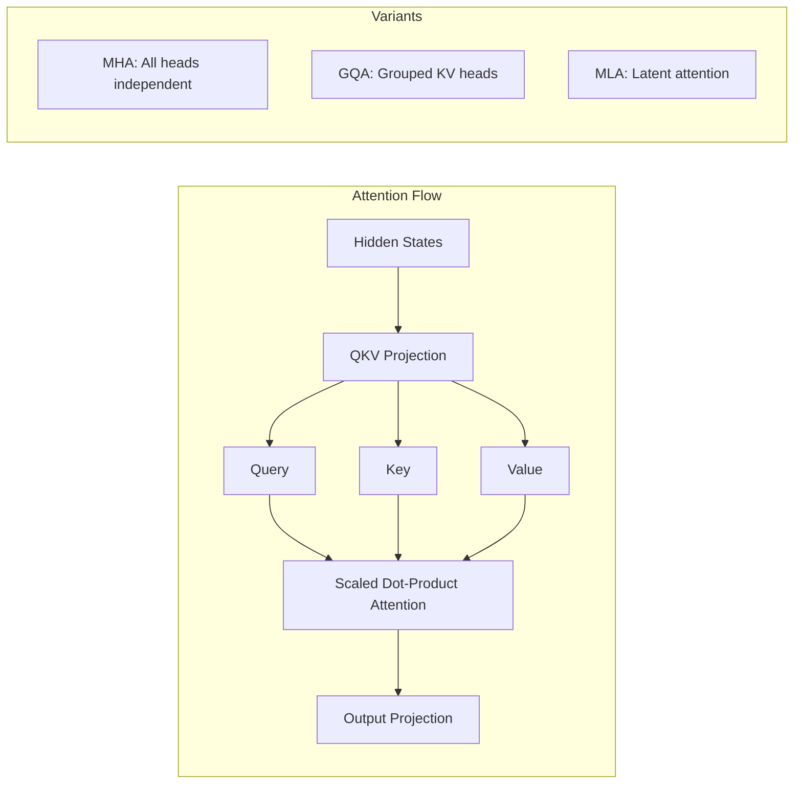
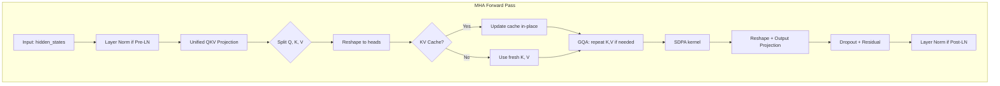
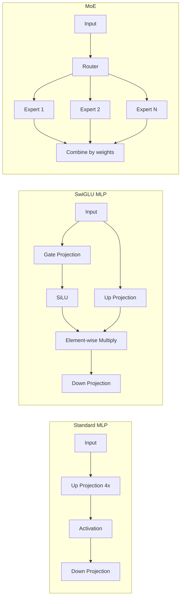
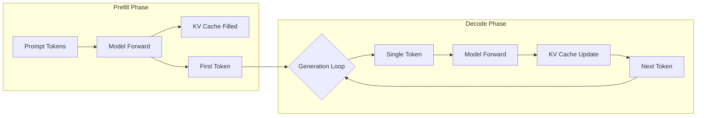
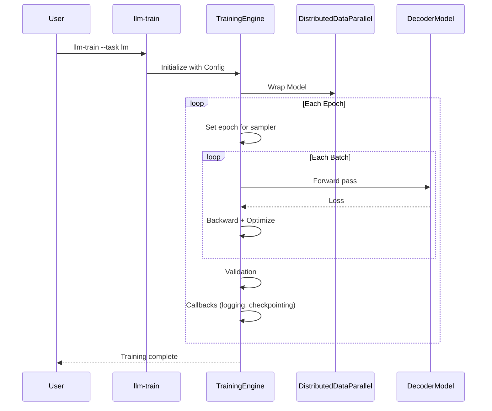

# Architecture Documentation

This document provides a deep dive into the architecture of the `llm` project, explaining its core design principles, component structure, and key abstractions.

## Design Philosophy

The project follows a **Modular & Composable** design philosophy:

* **src-layout**: Code is isolated in `src/` to prevent import layout confusion.
* **Separation of Concerns**:
    * `core`: Pure, reusable PyTorch modules (Attention, MLP, Norm).
    * `models`: Logic to assemble core components into full architectures (Decoder).
    * `training`: Orchestration of training loops, DDP, logging.
    * `serving`: High-performance inference API (FastAPI).
* **Registry Pattern**: Core components are decoupled and selectable via configuration.
* **Configuration as Code**: Pydantic models define type-safe, validating configurations.

## Directory Structure

```text
src/llm/
├── core/                    # Reusable PyTorch modules
│   ├── attn/               # Attention mechanisms (MHA, MLA, SDPA)
│   ├── embedding.py        # Token + positional embeddings (RoPE, ALiBi)
│   ├── lora.py            # LoRA adapters
│   ├── qlora.py           # QLoRA with NF4 quantization
│   ├── adalora.py         # AdaLoRA (SVD-form, mask-buffer for future pruning; T3 #40)
│   ├── prefix_tuning.py   # Prefix Tuning (T2 PEFT foundation + trainer slice)
│   ├── ia3.py             # IA³ — multiplicative PEFT (T2 PEFT foundation + trainer slice)
│   ├── bitfit.py          # BitFit — bias-only fine-tuning (T2 PEFT foundation + trainer slice)
│   ├── adapter.py         # Adapter Layers (Houlsby 2019) (T2 PEFT foundation + trainer slice)
│   ├── pfeiffer_adapter.py # Pfeiffer Adapter — FFN-only Houlsby variant (T2 PEFT #45)
│   ├── kv_cache.py        # Pre-allocated KV cache
│   ├── mlp.py             # Standard MLP with SwiGLU
│   ├── moe.py             # Mixture of Experts
│   ├── norm.py            # RMSNorm, LayerNorm
│   ├── peft/              # PEFT method registry (T2 PEFT #43, #44, #47)
│   │   ├── registry.py    # PEFT_REGISTRY + apply_peft/merge_peft/... dispatch
│   │   ├── methods.py     # 8 built-in registrations (lora, qlora, adalora, prefix_tuning, ia3, bitfit, adapter, pfeiffer_adapter)
│   │   ├── types.py       # PEFTMethod dataclass + TargetModuleFilter
│   │   └── checkpoint.py  # save_peft / load_peft adapter-only checkpoint helpers (T2 PEFT #47)
│   ├── registry.py        # ATTENTION/MLP/NORM registries (runtime.Registry)
│   └── transformer_block.py
├── models/                 # Complete model architectures
│   └── decoder.py         # Decoder-only transformer
├── training/              # Training infrastructure
│   ├── core/              # Engine, callbacks, config
│   └── tasks/             # Task-specific trainers (LM, SFT)
├── data/                  # Data layer (datasets + modules + sources)
│   ├── base.py            # BaseDataModule, MapDataModule, StreamDataModule
│   ├── sources.py         # Pluggable text sources (local, HF streaming)
│   ├── stream_state.py    # Checkpointable cursors for streaming shards
│   ├── datasets/          # PyTorch Dataset implementations
│   └── modules/           # DataModule implementations (text, sft, dpo, …)
├── generation/            # Generation backends and eager inference
│   ├── eager.py           # stream_generate, batch_generate
│   ├── sampling.py        # Shared temperature/top-k/top-p sampling
│   ├── registry.py        # BACKEND_REGISTRY + get_generation_backend
│   └── backends.py        # EagerGenerationBackend + BatchedGenerationBackend
├── runtime/               # Plugin kernel (registries, factories, entry points)
│   ├── registry.py        # Generic Registry[T]
│   ├── bootstrap.py       # Built-in model builder registration
│   ├── plugins.py         # setuptools entry point discovery
│   ├── model_factory.py   # ModelFactory / MODEL_REGISTRY
│   ├── tokenizer_factory.py
│   └── checkpoint.py      # CheckpointContributor protocol
├── export/                # Export backends + ONNX/TorchScript built-ins
│   ├── registry.py        # EXPORT_REGISTRY + export_model dispatch
│   ├── onnx.py            # ONNX reference implementation (stable API)
│   ├── torchscript.py     # TorchScript target (entry-point registered)
│   └── _wrapper.py        # Shared ExportCacheWrapper for trace backends
├── evaluation/            # Offline evaluation
│   ├── runner.py          # EvaluationRunner (unified entry)
│   └── eval_tasks/        # Per-task evaluators (lm)
├── training/              # Training infrastructure
│   ├── core/              # Engine, callbacks, config
│   ├── task_registry.py   # TaskRegistry (task + data_module factory)
│   ├── distributed/       # DDP / FSDP wrap helpers
│   └── tasks/             # Task trainers + builtin registration
├── tokenization/          # Tokenizer 实现
├── serving/               # Inference API
│   ├── api.py             # FastAPI with OpenAI-compatible endpoints
│   ├── loader.py          # Training checkpoint + tokenizer loading
│   ├── generation_service.py  # REST/chat → GenerationBackend
│   └── batch_engine.py    # ContinuousBatchingEngine (continuous batching path)
```

## System Overview

```mermaid
graph TD
    Config[Configuration (Pydantic)] --> Training[Training Engine]
    Config --> Serving[Serving Engine]

    subgraph "Core Layers (src/llm/core)"
        Reg[Registry]
        MHA[MultiHeadAttention]
        MLP[MLP / MoE]
        Norm[RMSNorm / LayerNorm]
    end

    subgraph "Data Abstraction (src/llm/data)"
        Tokenizer[BaseTokenizer / HFTokenizer]
        Dataset[TextDataset]
        DataModule[TextDataModule]
    end

    subgraph "Models (src/llm/models)"
        Decoder[DecoderModel]
    end

    Reg --> MHA
    Reg --> MLP

    Training --> DataModule
    Training --> Decoder

    DataModule --> Tokenizer
    Dataset --> Tokenizer

    Decoder --> MHA
    Decoder --> MLP
    Decoder --> Norm
```

## Core Components & Registry

To support rapid experimentation with different architectural variants (e.g., Flash Attention, SwiGLU, MoE), we employ a **Registry Pattern** backed by `runtime.Registry`.

### Component Registries

Located in `src/llm/core/registry.py`:

* **`ATTENTION_REGISTRY`**: `mha` (Standard, 支持 GQA/MQA), `mla` (Latent attention placeholder; supports KV cache — see [Tier 3 #31](../audits/2026-07-12-tickets/31-mla-kv-cache.md))
* **`MLP_REGISTRY`**: `mlp` (Standard), `moe` (Mixture of Experts)
* **`NORM_REGISTRY`**: `layer_norm`, `rms_norm` (via `norm_impl` in config)

Components register themselves via decorators:

```python
@register_attention("mha")
class MultiHeadAttention(nn.Module): ...
```

Configuration controls which implementation is used:

```yaml
model:
  attn_impl: "mha"
  mlp_impl: "moe"
  norm_impl: "rms_norm"
```

> **Note**: `attn_impl: mla` supports KV cache (both linear `KVCache` and paged `PagedKVCache`). The current MLA is the **placeholder** variant (learnable latent queries + uniform-mean output broadcast over the sequence); the architectural benefit of per-position caching is limited because the output is uniform. Real DeepSeek-V2-style MLA (latent-compressed K, V + decoupled RoPE) is a separate follow-up.

## Data Abstraction

The project decouples data loading from tokenization logic to support both simple character-level experiments and production-grade HuggingFace tokenizers.

### Tokenizer Hierarchy

* **`BaseTokenizer` (Protocol)**: Defines the interface (`encode`, `decode`, `vocab_size`).
* **`SimpleCharacterTokenizer`**: A lightweight, dependency-free tokenizer for basic testing.
* **`HFTokenizer`**: A wrapper around `transformers.AutoTokenizer`, enabling access to the entire HuggingFace ecosystem.

### Data Module

`TextDataModule` uses `DataConfig` to determine which tokenizer to load and how to process the dataset.

## Configuration System

All configuration is managed via Pydantic models in `src/llm/training/core/config.py`, offering:

* **Type Safety**: Automatic type validation.
* **Environment Variables**: Override via `LLM_MODEL__HIDDEN_SIZE=1024`.
* **CLI Integration**: `Typer` automatically exposes these configs as command-line arguments.

### Config Structure

* **`ModelConfig`**: Architecture params (`hidden_size`, `num_layers`, `attn_impl`).
* **`DataConfig`**: Data params (`tokenizer_type`, `dataset_path`).
* **`TrainingConfig`**: loop params (`epochs`, `lr`).
* **`DistributedConfig`**: DDP params (`master_addr`, `world_size`).
* **`OptimizationConfig`**: performance (`use_compile`, `use_amp`).

## Plugin Kernel (`runtime/`)

Third-party and built-in extensions register through a shared **`Registry[T]`** and optional **setuptools entry points** in `pyproject.toml`:

| Entry point group | Registry | Example |
|-------------------|----------|---------|
| `llm.models` | `MODEL_REGISTRY` | `decoder`, `regression_mlp` builders |
| `llm.generation_backends` | `BACKEND_REGISTRY` | `eager`, `batched` |
| `llm.data_sources` | `SOURCE_REGISTRY` | `local`, `hf` streaming; `dedup_local` / `dedup_hf` compose any inner source with `DedupTextSource` (T3 #39) |
| `llm.export_backends` | `EXPORT_REGISTRY` | `onnx` (built-in), `torchscript` |
| `llm.peft_methods` | `PEFT_REGISTRY` | `lora`, `qlora`, `adalora`, `prefix_tuning`, `ia3`, `bitfit`, `adapter`, `pfeiffer_adapter` (T2 PEFT #43, #44, #45, #46, #47) |
| `llm.tasks` | hooks via `load_entry_point_hooks` | third-party `TASK_REGISTRY.register(...)` |

Built-in model builders register via **setuptools entry points** only (`bootstrap.ensure_builtins_registered()` → `load_entry_point_registry("llm.models", ...)`). Attention/MLP/NORM register on module import. `train.py` additionally invokes `llm.tasks` hooks so external packages can add CLI tasks without editing core code.

## Attention Mechanism

The project supports multiple attention variants through the registry pattern:



### Supported Features

| Feature            | Description                                            |
| ------------------ | ------------------------------------------------------ |
| **GQA**            | Multiple query heads share KV heads (memory efficient) |
| **Sliding Window** | Limits attention scope for long sequences              |
| **KV Cache**       | Caches key/value for autoregressive generation         |
| **RoPE**           | Rotary position embeddings with scaling                |
| **ALiBi**          | Attention with linear biases                           |

### Multi-Head Attention Internals

The `MultiHeadAttention` class (`src/llm/core/attn/mha.py`) implements:



**Key Design Decisions**:

1. **Unified QKV Projection**: Single linear layer for Q, K, V improves memory throughput
2. **Pre-LN Default**: More stable gradients for deep networks
3. **SDPA Backend**: Uses `torch.nn.functional.scaled_dot_product_attention` for Flash Attention when available

### MLP / MoE Architecture



## Data Flow Analysis

### Training Data Flow

```mermaid
graph LR
    subgraph "Data Pipeline"
        Raw[Raw Text] --> Tok[Tokenizer]
        Tok --> DS[TextDataset]
        DS --> DL[DataLoader]
        DL --> Batch[Collated Batch]
    end

    subgraph "Model Forward"
        Batch --> Emb[Embedding + RoPE]
        Emb --> Blocks[N x TransformerBlock]
        Blocks --> Norm[Final Norm]
        Norm --> LMHead[LM Head]
        LMHead --> Logits
    end

    subgraph "Loss & Backward"
        Logits --> CE[Cross-Entropy Loss]
        CE --> Grad[Gradients]
        Grad --> Opt[Optimizer Step]
    end
```



### Inference Data Flow



## Training Pipeline


