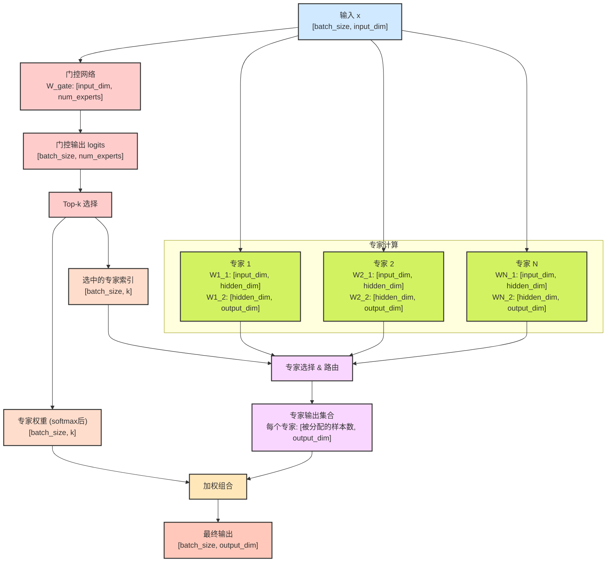
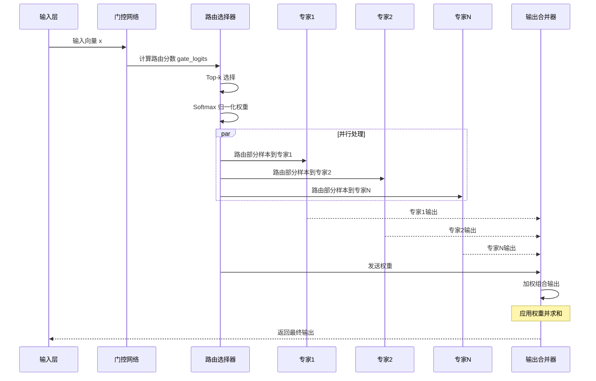

# MoE

## 工作流程图

```mermaid
graph TD
    A["输入 x
    [batch_size, input_dim]"] --> B["门控网络
W_gate: [input_dim, num_experts]"]

B --> C["门控输出 logits
[batch_size, num_experts]"]

C --> D["Top-k 选择"]

D --> E1["选中的专家索引
[batch_size, k]"]

D --> E2["专家权重 (softmax后)
[batch_size, k]"]

subgraph "专家计算"
F1["专家 1
W1_1: [input_dim, hidden_dim]
W1_2: [hidden_dim, output_dim]"]

F2["专家 2
W2_1: [input_dim, hidden_dim]
W2_2: [hidden_dim, output_dim]"]

FN["专家 N
WN_1: [input_dim, hidden_dim]
WN_2: [hidden_dim, output_dim]"]
end

A --> F1
A --> F2
A --> FN

E1 --> G["专家选择 & 路由"]

F1 --> G
F2 --> G
FN --> G

G --> H["专家输出集合
每个专家: [被分配的样本数, output_dim]"]

E2 --> I["加权组合"]
H --> I

I --> J["最终输出
[batch_size, output_dim]"]

style A fill:#d0e9ff,stroke:#333,stroke-width:2px
style B fill:#ffcccc,stroke:#333,stroke-width:2px
style C fill:#ffcccc,stroke:#333,stroke-width:2px
style D fill:#ffcccc,stroke:#333,stroke-width:2px
style E1 fill:#ffddcc,stroke:#333,stroke-width:2px
style E2 fill:#ffddcc,stroke:#333,stroke-width:2px
style F1 fill:#d3f261,stroke:#333,stroke-width:2px
style F2 fill:#d3f261,stroke:#333,stroke-width:2px
style FN fill:#d3f261,stroke:#333,stroke-width:2px
style G fill:#f9d6ff,stroke:#333,stroke-width:2px
style H fill:#f9d6ff,stroke:#333,stroke-width:2px
style I fill:#ffe7ba,stroke:#333,stroke-width:2px
style J fill:#ffc8ba,stroke:#333,stroke-width:2px
```

## 执行序列图

```mermaid
sequenceDiagram
    participant Input as 输入层
    participant Gate as 门控网络
    participant Router as 路由选择器
    participant E1 as 专家1
    participant E2 as 专家2
    participant EN as 专家N
    participant Combiner as 输出合并器

    Input->>Gate: 输入向量 x
    Gate->>Router: 计算路由分数 gate_logits
    Router->>Router: Top-k 选择
    Router->>Router: Softmax 归一化权重

    par 并行处理
        Router->>E1: 路由部分样本到专家1
        Router->>E2: 路由部分样本到专家2
        Router->>EN: 路由部分样本到专家N
    end

    E1-->>Combiner: 专家1输出
    E2-->>Combiner: 专家2输出
    EN-->>Combiner: 专家N输出

    Router->>Combiner: 发送权重
    Combiner->>Combiner: 加权组合输出

    Note over Combiner: 应用权重并求和

    Combiner-->>Input: 返回最终输出
```
